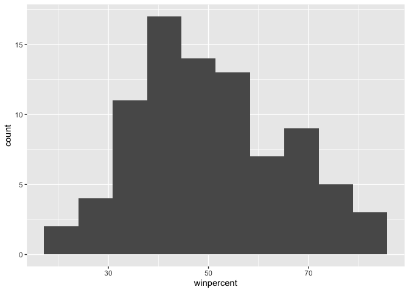

# Class 09: Halloween Mini Project
Christopher Levinger (A17390693)

Today we will make a step back to some data we can taste and explore the
correlation structure and principal components of some Halloween candy.

``` r
candy_file <- "candy-data.txt"
read.delim(candy_file)
```

       competitorname.chocolate.fruity.caramel.peanutyalmondy.nougat.crispedricewafer.hard.bar.pluribus.sugarpercent.pricepercent.winpercent
    1                                                                              100 Grand,1,0,1,0,0,1,0,1,0,.73199999,.86000001,66.971725
    2                                                                           3 Musketeers,1,0,0,0,1,0,0,1,0,.60399997,.51099998,67.602936
    3                                                                                         One dime,0,0,0,0,0,0,0,0,0,.011,.116,32.261086
    4                                                                                 One quarter,0,0,0,0,0,0,0,0,0,.011,.51099998,46.116505
    5                                                                              Air Heads,0,1,0,0,0,0,0,0,0,.90600002,.51099998,52.341465
    6                                                                                  Almond Joy,1,0,0,1,0,0,0,1,0,.465,.76700002,50.347546
    7                                                                              Baby Ruth,1,0,1,1,1,0,0,1,0,.60399997,.76700002,56.914547
    8                                                                     Boston Baked Beans,0,0,0,1,0,0,0,0,1,.31299999,.51099998,23.417824
    9                                                                             Candy Corn,0,0,0,0,0,0,0,0,1,.90600002,.32499999,38.010963
    10                                                                    Caramel Apple Pops,0,1,1,0,0,0,0,0,0,.60399997,.32499999,34.517681
    11                                                                       Charleston Chew,1,0,0,0,1,0,0,1,0,.60399997,.51099998,38.975037
    12                                                            Chewey Lemonhead Fruit Mix,0,1,0,0,0,0,0,0,1,.73199999,.51099998,36.017628
    13                                                                                   Chiclets,0,1,0,0,0,0,0,0,1,.046,.32499999,24.524988
    14                                                                                  Dots,0,1,0,0,0,0,0,0,1,.73199999,.51099998,42.272076
    15                                                                             Dum Dums,0,1,0,0,0,0,1,0,0,.73199999,.034000002,39.460556
    16                                                                               Fruit Chews,0,1,0,0,0,0,0,0,1,.127,.034000002,43.088924
    17                                                                               Fun Dip,0,1,0,0,0,0,1,0,0,.73199999,.32499999,39.185505
    18                                                                            Gobstopper,0,1,0,0,0,0,1,0,1,.90600002,.45300001,46.783348
    19                                                                                Haribo Gold Bears,0,1,0,0,0,0,0,0,1,.465,.465,57.11974
    20                                                                               Haribo Happy Cola,0,0,0,0,0,0,0,0,1,.465,.465,34.158958
    21                                                                                Haribo Sour Bears,0,1,0,0,0,0,0,0,1,.465,.465,51.41243
    22                                                                              Haribo Twin Snakes,0,1,0,0,0,0,0,0,1,.465,.465,42.178772
    23                                                                          Hershey's Kisses,1,0,0,0,0,0,0,0,1,.127,.093000002,55.375454
    24                                                                     Hershey's Krackel,1,0,0,0,0,1,0,1,0,.43000001,.91799998,62.284481
    25                                                              Hershey's Milk Chocolate,1,0,0,0,0,0,0,1,0,.43000001,.91799998,56.490501
    26                                                                Hershey's Special Dark,1,0,0,0,0,0,0,1,0,.43000001,.91799998,59.236122
    27                                                                           Jawbusters,0,1,0,0,0,0,1,0,1,.093000002,.51099998,28.127439
    28                                                                                Junior Mints,1,0,0,0,0,0,0,0,1,.197,.51099998,57.21925
    29                                                                                 Kit Kat,1,0,0,0,0,1,0,1,0,.31299999,.51099998,76.7686
    30                                                                                      Laffy Taffy,0,1,0,0,0,0,0,0,0,.22,.116,41.389557
    31                                                                                       Lemonhead,0,1,0,0,0,0,1,0,0,.046,.104,39.141056
    32                                                           Lifesavers big ring gummies,0,1,0,0,0,0,0,0,0,.26699999,.27900001,52.911392
    33                                                                    Peanut butter M&M's,1,0,0,1,0,0,0,0,1,.82499999,.65100002,71.46505
    34                                                                                 M&M's,1,0,0,0,0,0,0,0,1,.82499999,.65100002,66.574585
    35                                                                            Mike & Ike,0,1,0,0,0,0,0,0,1,.87199998,.32499999,46.411716
    36                                                                             Milk Duds,1,0,1,0,0,0,0,0,1,.30199999,.51099998,55.064072
    37                                                                             Milky Way,1,0,1,0,1,0,0,1,0,.60399997,.65100002,73.099556
    38                                                                    Milky Way Midnight,1,0,1,0,1,0,0,1,0,.73199999,.44100001,60.800701
    39                                                               Milky Way Simply Caramel,1,0,1,0,0,0,0,1,0,.96499997,.86000001,64.35334
    40                                                                                Mounds,1,0,0,0,0,0,0,1,0,.31299999,.86000001,47.829754
    41                                                                           Mr Good Bar,1,0,0,1,0,0,0,1,0,.31299999,.91799998,54.526451
    42                                                                                 Nerds,0,1,0,0,0,0,1,0,1,.84799999,.32499999,55.354046
    43                                                                   Nestle Butterfinger,1,0,0,1,0,0,0,1,0,.60399997,.76700002,70.735641
    44                                                                          Nestle Crunch,1,0,0,0,0,1,0,1,0,.31299999,.76700002,66.47068
    45                                                                                  Nik L Nip,0,1,0,0,0,0,0,0,1,.197,.97600001,22.445341
    46                                                                                   Now & Later,0,1,0,0,0,0,0,0,1,.22,.32499999,39.4468
    47                                                                                     Payday,0,0,0,1,1,0,0,1,0,.465,.76700002,46.296597
    48                                                                           Peanut M&Ms,1,0,0,1,0,0,0,0,1,.59299999,.65100002,69.483788
    49                                                                              Pixie Sticks,0,0,0,0,0,0,0,0,1,.093000002,.023,37.722336
    50                                                                             Pop Rocks,0,1,0,0,0,0,1,0,1,.60399997,.83700001,41.265511
    51                                                                                  Red vines,0,1,0,0,0,0,0,0,1,.58099997,.116,37.348522
    52                                                                   Reese's Miniatures,1,0,0,1,0,0,0,0,0,.034000002,.27900001,81.866257
    53                                                              Reese's Peanut Butter cup,1,0,0,1,0,0,0,0,0,.72000003,.65100002,84.18029
    54                                                                         Reese's pieces,1,0,0,1,0,0,0,0,1,.40599999,.65100002,73.43499
    55                                                           Reese's stuffed with pieces,1,0,0,1,0,0,0,0,0,.98799998,.65100002,72.887901
    56                                                                              Ring pop,0,1,0,0,0,0,1,0,0,.73199999,.96499997,35.290756
    57                                                                                  Rolo,1,0,1,0,0,0,0,0,1,.86000001,.86000001,65.716286
    58                                                                    Root Beer Barrels,0,0,0,0,0,0,1,0,1,.73199999,.068999998,29.703691
    59                                                                                 Runts,0,1,0,0,0,0,1,0,1,.87199998,.27900001,42.849144
    60                                                                                             Sixlets,1,0,0,0,0,0,0,0,1,.22,.081,34.722
    61                                                                            Skittles original,0,1,0,0,0,0,0,0,1,.94099998,.22,63.08514
    62                                                                          Skittles wildberry,0,1,0,0,0,0,0,0,1,.94099998,.22,55.103695
    63                                                                       Nestle Smarties,1,0,0,0,0,0,0,0,1,.26699999,.97600001,37.887188
    64                                                                             Smarties candy,0,1,0,0,0,0,1,0,1,.26699999,.116,45.995827
    65                                                                                   Snickers,1,0,1,1,1,0,0,1,0,.546,.65100002,76.673782
    66                                                                      Snickers Crisper,1,0,1,1,0,1,0,1,0,.60399997,.65100002,59.529251
    67                                                                           Sour Patch Kids,0,1,0,0,0,0,0,0,1,.068999998,.116,59.863998
    68                                                                     Sour Patch Tricksters,0,1,0,0,0,0,0,0,1,.068999998,.116,52.825947
    69                                                                                   Starburst,0,1,0,0,0,0,0,0,1,.15099999,.22,67.037628
    70                                                                  Strawberry bon bons,0,1,0,0,0,0,1,0,1,.56900001,.057999998,34.578991
    71                                                                           Sugar Babies,0,0,1,0,0,0,0,0,1,.96499997,.76700002,33.43755
    72                                                                           Sugar Daddy,0,0,1,0,0,0,0,0,0,.41800001,.32499999,32.230995
    73                                                                                    Super Bubble,0,1,0,0,0,0,0,0,0,.162,.116,27.303865
    74                                                                               Swedish Fish,0,1,0,0,0,0,0,0,1,.60399997,.755,54.861111
    75                                                                           Tootsie Pop,1,1,0,0,0,0,1,0,0,.60399997,.32499999,48.982651
    76                                                                  Tootsie Roll Juniors,1,0,0,0,0,0,0,0,0,.31299999,.51099998,43.068897
    77                                                                       Tootsie Roll Midgies,1,0,0,0,0,0,0,0,1,.17399999,.011,45.736748
    78                                                                    Tootsie Roll Snack Bars,1,0,0,0,0,0,0,1,0,.465,.32499999,49.653503
    79                                                                          Trolli Sour Bites,0,1,0,0,0,0,0,0,1,.31299999,.255,47.173229
    80                                                                                       Twix,1,0,1,0,0,1,0,1,0,.546,.90600002,81.642914
    81                                                                                        Twizzlers,0,1,0,0,0,0,0,0,0,.22,.116,45.466282
    82                                                                                  Warheads,0,1,0,0,0,0,1,0,0,.093000002,.116,39.011898
    83                                                                  Welch's Fruit Snacks,0,1,0,0,0,0,0,0,1,.31299999,.31299999,44.375519
    84                                                                 Werther's Original Caramel,0,0,1,0,0,0,1,0,0,.186,.26699999,41.904308
    85                                                                              Whoppers,1,0,0,0,0,1,0,0,1,.87199998,.84799999,49.524113

``` r
candy=read.csv(candy_file,row.names=1)
head(candy)
```

                 chocolate fruity caramel peanutyalmondy nougat crispedricewafer
    100 Grand            1      0       1              0      0                1
    3 Musketeers         1      0       0              0      1                0
    One dime             0      0       0              0      0                0
    One quarter          0      0       0              0      0                0
    Air Heads            0      1       0              0      0                0
    Almond Joy           1      0       0              1      0                0
                 hard bar pluribus sugarpercent pricepercent winpercent
    100 Grand       0   1        0        0.732        0.860   66.97173
    3 Musketeers    0   1        0        0.604        0.511   67.60294
    One dime        0   0        0        0.011        0.116   32.26109
    One quarter     0   0        0        0.011        0.511   46.11650
    Air Heads       0   0        0        0.906        0.511   52.34146
    Almond Joy      0   1        0        0.465        0.767   50.34755

> Q1. How many different candy types are in this dataset? 85 different
> candy types.

``` r
nrow(candy)
```

    [1] 85

> Q2: How many fruity candy types are in the dataset? It appears after
> summing the column with fruity in it, there are 38 total fruity
> candies.

``` r
sum(candy$fruity)
```

    [1] 38

``` r
candy[candy$fruity == 1, ]
```

                                chocolate fruity caramel peanutyalmondy nougat
    Air Heads                           0      1       0              0      0
    Caramel Apple Pops                  0      1       1              0      0
    Chewey Lemonhead Fruit Mix          0      1       0              0      0
    Chiclets                            0      1       0              0      0
    Dots                                0      1       0              0      0
    Dum Dums                            0      1       0              0      0
    Fruit Chews                         0      1       0              0      0
    Fun Dip                             0      1       0              0      0
    Gobstopper                          0      1       0              0      0
    Haribo Gold Bears                   0      1       0              0      0
    Haribo Sour Bears                   0      1       0              0      0
    Haribo Twin Snakes                  0      1       0              0      0
    Jawbusters                          0      1       0              0      0
    Laffy Taffy                         0      1       0              0      0
    Lemonhead                           0      1       0              0      0
    Lifesavers big ring gummies         0      1       0              0      0
    Mike & Ike                          0      1       0              0      0
    Nerds                               0      1       0              0      0
    Nik L Nip                           0      1       0              0      0
    Now & Later                         0      1       0              0      0
    Pop Rocks                           0      1       0              0      0
    Red vines                           0      1       0              0      0
    Ring pop                            0      1       0              0      0
    Runts                               0      1       0              0      0
    Skittles original                   0      1       0              0      0
    Skittles wildberry                  0      1       0              0      0
    Smarties candy                      0      1       0              0      0
    Sour Patch Kids                     0      1       0              0      0
    Sour Patch Tricksters               0      1       0              0      0
    Starburst                           0      1       0              0      0
    Strawberry bon bons                 0      1       0              0      0
    Super Bubble                        0      1       0              0      0
    Swedish Fish                        0      1       0              0      0
    Tootsie Pop                         1      1       0              0      0
    Trolli Sour Bites                   0      1       0              0      0
    Twizzlers                           0      1       0              0      0
    Warheads                            0      1       0              0      0
    Welch's Fruit Snacks                0      1       0              0      0
                                crispedricewafer hard bar pluribus sugarpercent
    Air Heads                                  0    0   0        0        0.906
    Caramel Apple Pops                         0    0   0        0        0.604
    Chewey Lemonhead Fruit Mix                 0    0   0        1        0.732
    Chiclets                                   0    0   0        1        0.046
    Dots                                       0    0   0        1        0.732
    Dum Dums                                   0    1   0        0        0.732
    Fruit Chews                                0    0   0        1        0.127
    Fun Dip                                    0    1   0        0        0.732
    Gobstopper                                 0    1   0        1        0.906
    Haribo Gold Bears                          0    0   0        1        0.465
    Haribo Sour Bears                          0    0   0        1        0.465
    Haribo Twin Snakes                         0    0   0        1        0.465
    Jawbusters                                 0    1   0        1        0.093
    Laffy Taffy                                0    0   0        0        0.220
    Lemonhead                                  0    1   0        0        0.046
    Lifesavers big ring gummies                0    0   0        0        0.267
    Mike & Ike                                 0    0   0        1        0.872
    Nerds                                      0    1   0        1        0.848
    Nik L Nip                                  0    0   0        1        0.197
    Now & Later                                0    0   0        1        0.220
    Pop Rocks                                  0    1   0        1        0.604
    Red vines                                  0    0   0        1        0.581
    Ring pop                                   0    1   0        0        0.732
    Runts                                      0    1   0        1        0.872
    Skittles original                          0    0   0        1        0.941
    Skittles wildberry                         0    0   0        1        0.941
    Smarties candy                             0    1   0        1        0.267
    Sour Patch Kids                            0    0   0        1        0.069
    Sour Patch Tricksters                      0    0   0        1        0.069
    Starburst                                  0    0   0        1        0.151
    Strawberry bon bons                        0    1   0        1        0.569
    Super Bubble                               0    0   0        0        0.162
    Swedish Fish                               0    0   0        1        0.604
    Tootsie Pop                                0    1   0        0        0.604
    Trolli Sour Bites                          0    0   0        1        0.313
    Twizzlers                                  0    0   0        0        0.220
    Warheads                                   0    1   0        0        0.093
    Welch's Fruit Snacks                       0    0   0        1        0.313
                                pricepercent winpercent
    Air Heads                          0.511   52.34146
    Caramel Apple Pops                 0.325   34.51768
    Chewey Lemonhead Fruit Mix         0.511   36.01763
    Chiclets                           0.325   24.52499
    Dots                               0.511   42.27208
    Dum Dums                           0.034   39.46056
    Fruit Chews                        0.034   43.08892
    Fun Dip                            0.325   39.18550
    Gobstopper                         0.453   46.78335
    Haribo Gold Bears                  0.465   57.11974
    Haribo Sour Bears                  0.465   51.41243
    Haribo Twin Snakes                 0.465   42.17877
    Jawbusters                         0.511   28.12744
    Laffy Taffy                        0.116   41.38956
    Lemonhead                          0.104   39.14106
    Lifesavers big ring gummies        0.279   52.91139
    Mike & Ike                         0.325   46.41172
    Nerds                              0.325   55.35405
    Nik L Nip                          0.976   22.44534
    Now & Later                        0.325   39.44680
    Pop Rocks                          0.837   41.26551
    Red vines                          0.116   37.34852
    Ring pop                           0.965   35.29076
    Runts                              0.279   42.84914
    Skittles original                  0.220   63.08514
    Skittles wildberry                 0.220   55.10370
    Smarties candy                     0.116   45.99583
    Sour Patch Kids                    0.116   59.86400
    Sour Patch Tricksters              0.116   52.82595
    Starburst                          0.220   67.03763
    Strawberry bon bons                0.058   34.57899
    Super Bubble                       0.116   27.30386
    Swedish Fish                       0.755   54.86111
    Tootsie Pop                        0.325   48.98265
    Trolli Sour Bites                  0.255   47.17323
    Twizzlers                          0.116   45.46628
    Warheads                           0.116   39.01190
    Welch's Fruit Snacks               0.313   44.37552

``` r
candy["Twix",]$winpercent
```

    [1] 81.64291

``` r
candy["Kit Kat",]$winpercent
```

    [1] 76.7686

``` r
candy["Tootsie Roll Snack Bars",]$winpercent
```

    [1] 49.6535

> Q3. What is your favorite candy in the dataset and what is it’s
> winpercent value? My favorite candy in the dataset is Twix and its win
> percent value is 81.6421%. Q4. What is the winpercent value for “Kit
> Kat”? The win percent value for KitKat is 76.7686%. Q5. What is the
> winpercent value for “Tootsie Roll Snack Bars”? The winpercent value
> for Tootsie Roll Snack bars is 49.6535%.

## Exploratory Analysis

We can use the **skimr** package to get a quick overview of a given
dataset. This can be useful for the first time you encounter a new
dataset.

``` r
skimr::skim(candy)
```

|                                                  |       |
|:-------------------------------------------------|:------|
| Name                                             | candy |
| Number of rows                                   | 85    |
| Number of columns                                | 12    |
| \_\_\_\_\_\_\_\_\_\_\_\_\_\_\_\_\_\_\_\_\_\_\_   |       |
| Column type frequency:                           |       |
| numeric                                          | 12    |
| \_\_\_\_\_\_\_\_\_\_\_\_\_\_\_\_\_\_\_\_\_\_\_\_ |       |
| Group variables                                  | None  |

Data summary

**Variable type: numeric**

| skim_variable | n_missing | complete_rate | mean | sd | p0 | p25 | p50 | p75 | p100 | hist |
|:---|---:|---:|---:|---:|---:|---:|---:|---:|---:|:---|
| chocolate | 0 | 1 | 0.44 | 0.50 | 0.00 | 0.00 | 0.00 | 1.00 | 1.00 | ▇▁▁▁▆ |
| fruity | 0 | 1 | 0.45 | 0.50 | 0.00 | 0.00 | 0.00 | 1.00 | 1.00 | ▇▁▁▁▆ |
| caramel | 0 | 1 | 0.16 | 0.37 | 0.00 | 0.00 | 0.00 | 0.00 | 1.00 | ▇▁▁▁▂ |
| peanutyalmondy | 0 | 1 | 0.16 | 0.37 | 0.00 | 0.00 | 0.00 | 0.00 | 1.00 | ▇▁▁▁▂ |
| nougat | 0 | 1 | 0.08 | 0.28 | 0.00 | 0.00 | 0.00 | 0.00 | 1.00 | ▇▁▁▁▁ |
| crispedricewafer | 0 | 1 | 0.08 | 0.28 | 0.00 | 0.00 | 0.00 | 0.00 | 1.00 | ▇▁▁▁▁ |
| hard | 0 | 1 | 0.18 | 0.38 | 0.00 | 0.00 | 0.00 | 0.00 | 1.00 | ▇▁▁▁▂ |
| bar | 0 | 1 | 0.25 | 0.43 | 0.00 | 0.00 | 0.00 | 0.00 | 1.00 | ▇▁▁▁▂ |
| pluribus | 0 | 1 | 0.52 | 0.50 | 0.00 | 0.00 | 1.00 | 1.00 | 1.00 | ▇▁▁▁▇ |
| sugarpercent | 0 | 1 | 0.48 | 0.28 | 0.01 | 0.22 | 0.47 | 0.73 | 0.99 | ▇▇▇▇▆ |
| pricepercent | 0 | 1 | 0.47 | 0.29 | 0.01 | 0.26 | 0.47 | 0.65 | 0.98 | ▇▇▇▇▆ |
| winpercent | 0 | 1 | 50.32 | 14.71 | 22.45 | 39.14 | 47.83 | 59.86 | 84.18 | ▃▇▆▅▂ |

> Q6. Is there any variable/column that looks to be on a different scale
> to the majority of the other columns in the dataset? Yes the
> winpercent variable needs to be scaled differently than the other
> variables.

It looks like the last column `candy$winpercent` needs to be on a
different scale.

> Q7. What do you think a zero and one represent for the
> candy\$chocolate column? The 0 and 1 represent the cases where this
> candy type was either chosen as a favorite or not among the group with
> the mean of all such values displayed. 1 represents a selection of the
> chocolate candy and 0 represents not a selection of chocolate as the
> favorite candy.

> Q8. PLot a histogram of a winpercent values

``` r
hist(candy$winpercent, breaks=30)
```


``` r
library(ggplot2)
ggplot(candy) + 
  aes(winpercent) +
  geom_histogram(bins=10, fil="lightbulb")
```

    Warning in geom_histogram(bins = 10, fil = "lightbulb"): Ignoring unknown
    parameters: `fil`



``` r
summary(candy$winpercent)
```

       Min. 1st Qu.  Median    Mean 3rd Qu.    Max. 
      22.45   39.14   47.83   50.32   59.86   84.18 

> Q9. Is the sitribution of winpercent values symmetrical? The
> distribution is not symmetrical. There are more data points clustered
> to the left than to the right.

> Q10. Is the center of the distribution above or below 50%? No, it is
> below 50% for the median at 47.83%, but the mean is slightly above 50%
> at 50.32%..

> Q11. On average, is chocolate candy higher of lower ranked than fruit
> candy? Chocolate candy is much higher on average than fruit candy.

``` r
choc.inds <- candy$chocolate == 1
choc.candy <- candy[choc.inds, ]
choc.win <- choc.candy$winpercent
mean(choc.win)
```

    [1] 60.92153

``` r
fruity.inds <- candy$fruity == 1
fruity.candy <- candy[fruity.inds, ]
fruity.win <- fruity.candy$winpercent
mean(fruity.win)
```

    [1] 44.11974

``` r
candy [as.logical(candy$fruity),]$winpercent
```

     [1] 52.34146 34.51768 36.01763 24.52499 42.27208 39.46056 43.08892 39.18550
     [9] 46.78335 57.11974 51.41243 42.17877 28.12744 41.38956 39.14106 52.91139
    [17] 46.41172 55.35405 22.44534 39.44680 41.26551 37.34852 35.29076 42.84914
    [25] 63.08514 55.10370 45.99583 59.86400 52.82595 67.03763 34.57899 27.30386
    [33] 54.86111 48.98265 47.17323 45.46628 39.01190 44.37552

> Q12. Is this difference statistically significant? The t-test shows a
> statisically signficant difference between these two values confirmed
> by a very low p value less than 0.05 at 2.87137e-08.

``` r
ans <- t.test(choc.win, fruity.win)
ans
```


        Welch Two Sample t-test

    data:  choc.win and fruity.win
    t = 6.2582, df = 68.882, p-value = 2.871e-08
    alternative hypothesis: true difference in means is not equal to 0
    95 percent confidence interval:
     11.44563 22.15795
    sample estimates:
    mean of x mean of y 
     60.92153  44.11974 

Yes, with a p-value of

``` r
ans$p.value
```

    [1] 2.871378e-08

## 3. Overall Candy Rankings

There are two related functions that can help here, one is the classic
`sort()` function and `order()` function

``` r
x <- c(5,10,1,4)
sort(x, decreasing=TRUE)
```

    [1] 10  5  4  1

``` r
order(x)
```

    [1] 3 4 1 2

> Q14 What are the top 5 all time favorite candy types out of this set?
> The top five are seen below in the first five rows after applying the
> order function being Nik L Nip, Boston Baked Beans, Chiclets, Super
> Bubble, and Jawbusters.

``` r
inds <- order( candy$winpercent)
head(candy[inds,], 5)
```

                       chocolate fruity caramel peanutyalmondy nougat
    Nik L Nip                  0      1       0              0      0
    Boston Baked Beans         0      0       0              1      0
    Chiclets                   0      1       0              0      0
    Super Bubble               0      1       0              0      0
    Jawbusters                 0      1       0              0      0
                       crispedricewafer hard bar pluribus sugarpercent pricepercent
    Nik L Nip                         0    0   0        1        0.197        0.976
    Boston Baked Beans                0    0   0        1        0.313        0.511
    Chiclets                          0    0   0        1        0.046        0.325
    Super Bubble                      0    0   0        0        0.162        0.116
    Jawbusters                        0    1   0        1        0.093        0.511
                       winpercent
    Nik L Nip            22.44534
    Boston Baked Beans   23.41782
    Chiclets             24.52499
    Super Bubble         27.30386
    Jawbusters           28.12744

``` r
inds <- order(candy$winpercent, decreasing=TRUE)
candy[inds,]
```

                                chocolate fruity caramel peanutyalmondy nougat
    Reese's Peanut Butter cup           1      0       0              1      0
    Reese's Miniatures                  1      0       0              1      0
    Twix                                1      0       1              0      0
    Kit Kat                             1      0       0              0      0
    Snickers                            1      0       1              1      1
    Reese's pieces                      1      0       0              1      0
    Milky Way                           1      0       1              0      1
    Reese's stuffed with pieces         1      0       0              1      0
    Peanut butter M&M's                 1      0       0              1      0
    Nestle Butterfinger                 1      0       0              1      0
    Peanut M&Ms                         1      0       0              1      0
    3 Musketeers                        1      0       0              0      1
    Starburst                           0      1       0              0      0
    100 Grand                           1      0       1              0      0
    M&M's                               1      0       0              0      0
    Nestle Crunch                       1      0       0              0      0
    Rolo                                1      0       1              0      0
    Milky Way Simply Caramel            1      0       1              0      0
    Skittles original                   0      1       0              0      0
    Hershey's Krackel                   1      0       0              0      0
    Milky Way Midnight                  1      0       1              0      1
    Sour Patch Kids                     0      1       0              0      0
    Snickers Crisper                    1      0       1              1      0
    Hershey's Special Dark              1      0       0              0      0
    Junior Mints                        1      0       0              0      0
    Haribo Gold Bears                   0      1       0              0      0
    Baby Ruth                           1      0       1              1      1
    Hershey's Milk Chocolate            1      0       0              0      0
    Hershey's Kisses                    1      0       0              0      0
    Nerds                               0      1       0              0      0
    Skittles wildberry                  0      1       0              0      0
    Milk Duds                           1      0       1              0      0
    Swedish Fish                        0      1       0              0      0
    Mr Good Bar                         1      0       0              1      0
    Lifesavers big ring gummies         0      1       0              0      0
    Sour Patch Tricksters               0      1       0              0      0
    Air Heads                           0      1       0              0      0
    Haribo Sour Bears                   0      1       0              0      0
    Almond Joy                          1      0       0              1      0
    Tootsie Roll Snack Bars             1      0       0              0      0
    Whoppers                            1      0       0              0      0
    Tootsie Pop                         1      1       0              0      0
    Mounds                              1      0       0              0      0
    Trolli Sour Bites                   0      1       0              0      0
    Gobstopper                          0      1       0              0      0
    Mike & Ike                          0      1       0              0      0
    Payday                              0      0       0              1      1
    One quarter                         0      0       0              0      0
    Smarties candy                      0      1       0              0      0
    Tootsie Roll Midgies                1      0       0              0      0
    Twizzlers                           0      1       0              0      0
    Welch's Fruit Snacks                0      1       0              0      0
    Fruit Chews                         0      1       0              0      0
    Tootsie Roll Juniors                1      0       0              0      0
    Runts                               0      1       0              0      0
    Dots                                0      1       0              0      0
    Haribo Twin Snakes                  0      1       0              0      0
    Werther's Original Caramel          0      0       1              0      0
    Laffy Taffy                         0      1       0              0      0
    Pop Rocks                           0      1       0              0      0
    Dum Dums                            0      1       0              0      0
    Now & Later                         0      1       0              0      0
    Fun Dip                             0      1       0              0      0
    Lemonhead                           0      1       0              0      0
    Warheads                            0      1       0              0      0
    Charleston Chew                     1      0       0              0      1
    Candy Corn                          0      0       0              0      0
    Nestle Smarties                     1      0       0              0      0
    Pixie Sticks                        0      0       0              0      0
    Red vines                           0      1       0              0      0
    Chewey Lemonhead Fruit Mix          0      1       0              0      0
    Ring pop                            0      1       0              0      0
    Sixlets                             1      0       0              0      0
    Strawberry bon bons                 0      1       0              0      0
    Caramel Apple Pops                  0      1       1              0      0
    Haribo Happy Cola                   0      0       0              0      0
    Sugar Babies                        0      0       1              0      0
    One dime                            0      0       0              0      0
    Sugar Daddy                         0      0       1              0      0
    Root Beer Barrels                   0      0       0              0      0
    Jawbusters                          0      1       0              0      0
    Super Bubble                        0      1       0              0      0
    Chiclets                            0      1       0              0      0
    Boston Baked Beans                  0      0       0              1      0
    Nik L Nip                           0      1       0              0      0
                                crispedricewafer hard bar pluribus sugarpercent
    Reese's Peanut Butter cup                  0    0   0        0        0.720
    Reese's Miniatures                         0    0   0        0        0.034
    Twix                                       1    0   1        0        0.546
    Kit Kat                                    1    0   1        0        0.313
    Snickers                                   0    0   1        0        0.546
    Reese's pieces                             0    0   0        1        0.406
    Milky Way                                  0    0   1        0        0.604
    Reese's stuffed with pieces                0    0   0        0        0.988
    Peanut butter M&M's                        0    0   0        1        0.825
    Nestle Butterfinger                        0    0   1        0        0.604
    Peanut M&Ms                                0    0   0        1        0.593
    3 Musketeers                               0    0   1        0        0.604
    Starburst                                  0    0   0        1        0.151
    100 Grand                                  1    0   1        0        0.732
    M&M's                                      0    0   0        1        0.825
    Nestle Crunch                              1    0   1        0        0.313
    Rolo                                       0    0   0        1        0.860
    Milky Way Simply Caramel                   0    0   1        0        0.965
    Skittles original                          0    0   0        1        0.941
    Hershey's Krackel                          1    0   1        0        0.430
    Milky Way Midnight                         0    0   1        0        0.732
    Sour Patch Kids                            0    0   0        1        0.069
    Snickers Crisper                           1    0   1        0        0.604
    Hershey's Special Dark                     0    0   1        0        0.430
    Junior Mints                               0    0   0        1        0.197
    Haribo Gold Bears                          0    0   0        1        0.465
    Baby Ruth                                  0    0   1        0        0.604
    Hershey's Milk Chocolate                   0    0   1        0        0.430
    Hershey's Kisses                           0    0   0        1        0.127
    Nerds                                      0    1   0        1        0.848
    Skittles wildberry                         0    0   0        1        0.941
    Milk Duds                                  0    0   0        1        0.302
    Swedish Fish                               0    0   0        1        0.604
    Mr Good Bar                                0    0   1        0        0.313
    Lifesavers big ring gummies                0    0   0        0        0.267
    Sour Patch Tricksters                      0    0   0        1        0.069
    Air Heads                                  0    0   0        0        0.906
    Haribo Sour Bears                          0    0   0        1        0.465
    Almond Joy                                 0    0   1        0        0.465
    Tootsie Roll Snack Bars                    0    0   1        0        0.465
    Whoppers                                   1    0   0        1        0.872
    Tootsie Pop                                0    1   0        0        0.604
    Mounds                                     0    0   1        0        0.313
    Trolli Sour Bites                          0    0   0        1        0.313
    Gobstopper                                 0    1   0        1        0.906
    Mike & Ike                                 0    0   0        1        0.872
    Payday                                     0    0   1        0        0.465
    One quarter                                0    0   0        0        0.011
    Smarties candy                             0    1   0        1        0.267
    Tootsie Roll Midgies                       0    0   0        1        0.174
    Twizzlers                                  0    0   0        0        0.220
    Welch's Fruit Snacks                       0    0   0        1        0.313
    Fruit Chews                                0    0   0        1        0.127
    Tootsie Roll Juniors                       0    0   0        0        0.313
    Runts                                      0    1   0        1        0.872
    Dots                                       0    0   0        1        0.732
    Haribo Twin Snakes                         0    0   0        1        0.465
    Werther's Original Caramel                 0    1   0        0        0.186
    Laffy Taffy                                0    0   0        0        0.220
    Pop Rocks                                  0    1   0        1        0.604
    Dum Dums                                   0    1   0        0        0.732
    Now & Later                                0    0   0        1        0.220
    Fun Dip                                    0    1   0        0        0.732
    Lemonhead                                  0    1   0        0        0.046
    Warheads                                   0    1   0        0        0.093
    Charleston Chew                            0    0   1        0        0.604
    Candy Corn                                 0    0   0        1        0.906
    Nestle Smarties                            0    0   0        1        0.267
    Pixie Sticks                               0    0   0        1        0.093
    Red vines                                  0    0   0        1        0.581
    Chewey Lemonhead Fruit Mix                 0    0   0        1        0.732
    Ring pop                                   0    1   0        0        0.732
    Sixlets                                    0    0   0        1        0.220
    Strawberry bon bons                        0    1   0        1        0.569
    Caramel Apple Pops                         0    0   0        0        0.604
    Haribo Happy Cola                          0    0   0        1        0.465
    Sugar Babies                               0    0   0        1        0.965
    One dime                                   0    0   0        0        0.011
    Sugar Daddy                                0    0   0        0        0.418
    Root Beer Barrels                          0    1   0        1        0.732
    Jawbusters                                 0    1   0        1        0.093
    Super Bubble                               0    0   0        0        0.162
    Chiclets                                   0    0   0        1        0.046
    Boston Baked Beans                         0    0   0        1        0.313
    Nik L Nip                                  0    0   0        1        0.197
                                pricepercent winpercent
    Reese's Peanut Butter cup          0.651   84.18029
    Reese's Miniatures                 0.279   81.86626
    Twix                               0.906   81.64291
    Kit Kat                            0.511   76.76860
    Snickers                           0.651   76.67378
    Reese's pieces                     0.651   73.43499
    Milky Way                          0.651   73.09956
    Reese's stuffed with pieces        0.651   72.88790
    Peanut butter M&M's                0.651   71.46505
    Nestle Butterfinger                0.767   70.73564
    Peanut M&Ms                        0.651   69.48379
    3 Musketeers                       0.511   67.60294
    Starburst                          0.220   67.03763
    100 Grand                          0.860   66.97173
    M&M's                              0.651   66.57458
    Nestle Crunch                      0.767   66.47068
    Rolo                               0.860   65.71629
    Milky Way Simply Caramel           0.860   64.35334
    Skittles original                  0.220   63.08514
    Hershey's Krackel                  0.918   62.28448
    Milky Way Midnight                 0.441   60.80070
    Sour Patch Kids                    0.116   59.86400
    Snickers Crisper                   0.651   59.52925
    Hershey's Special Dark             0.918   59.23612
    Junior Mints                       0.511   57.21925
    Haribo Gold Bears                  0.465   57.11974
    Baby Ruth                          0.767   56.91455
    Hershey's Milk Chocolate           0.918   56.49050
    Hershey's Kisses                   0.093   55.37545
    Nerds                              0.325   55.35405
    Skittles wildberry                 0.220   55.10370
    Milk Duds                          0.511   55.06407
    Swedish Fish                       0.755   54.86111
    Mr Good Bar                        0.918   54.52645
    Lifesavers big ring gummies        0.279   52.91139
    Sour Patch Tricksters              0.116   52.82595
    Air Heads                          0.511   52.34146
    Haribo Sour Bears                  0.465   51.41243
    Almond Joy                         0.767   50.34755
    Tootsie Roll Snack Bars            0.325   49.65350
    Whoppers                           0.848   49.52411
    Tootsie Pop                        0.325   48.98265
    Mounds                             0.860   47.82975
    Trolli Sour Bites                  0.255   47.17323
    Gobstopper                         0.453   46.78335
    Mike & Ike                         0.325   46.41172
    Payday                             0.767   46.29660
    One quarter                        0.511   46.11650
    Smarties candy                     0.116   45.99583
    Tootsie Roll Midgies               0.011   45.73675
    Twizzlers                          0.116   45.46628
    Welch's Fruit Snacks               0.313   44.37552
    Fruit Chews                        0.034   43.08892
    Tootsie Roll Juniors               0.511   43.06890
    Runts                              0.279   42.84914
    Dots                               0.511   42.27208
    Haribo Twin Snakes                 0.465   42.17877
    Werther's Original Caramel         0.267   41.90431
    Laffy Taffy                        0.116   41.38956
    Pop Rocks                          0.837   41.26551
    Dum Dums                           0.034   39.46056
    Now & Later                        0.325   39.44680
    Fun Dip                            0.325   39.18550
    Lemonhead                          0.104   39.14106
    Warheads                           0.116   39.01190
    Charleston Chew                    0.511   38.97504
    Candy Corn                         0.325   38.01096
    Nestle Smarties                    0.976   37.88719
    Pixie Sticks                       0.023   37.72234
    Red vines                          0.116   37.34852
    Chewey Lemonhead Fruit Mix         0.511   36.01763
    Ring pop                           0.965   35.29076
    Sixlets                            0.081   34.72200
    Strawberry bon bons                0.058   34.57899
    Caramel Apple Pops                 0.325   34.51768
    Haribo Happy Cola                  0.465   34.15896
    Sugar Babies                       0.767   33.43755
    One dime                           0.116   32.26109
    Sugar Daddy                        0.325   32.23100
    Root Beer Barrels                  0.069   29.70369
    Jawbusters                         0.511   28.12744
    Super Bubble                       0.116   27.30386
    Chiclets                           0.325   24.52499
    Boston Baked Beans                 0.511   23.41782
    Nik L Nip                          0.976   22.44534

Make a bar pplot and order it by winpercent values \> Q15. Make a first
barplot of candy ranking based on winpercent values.

``` r
ggplot(candy) +
  aes(winpercent, rownames(candy)) +
  geom_col()
```


``` r
ggplot(candy) +
  aes(winpercent, reorder(rownames(candy), winpercent)) +
  geom_col()
```


> Q16: This is quite ugly, use the reorder() function to get the bars
> sorted by winpercent? Seen below.

``` r
ggplot(candy) +
  aes(x=winpercent, 
      y=reorder(rownames(candy), winpercent, fill="chocolate")) +
 geom_col()
```


Here we want a custom color vector to color each bar the way we want -
with chocolate and `fruity` candy together with whether it is a bar or
not.

``` r
mycols <- rep("gray", nrow(candy))
mycols[as.logical(candy$chocolate)] <- "chocolate"

mycols
```

     [1] "chocolate" "chocolate" "gray"      "gray"      "gray"      "chocolate"
     [7] "chocolate" "gray"      "gray"      "gray"      "chocolate" "gray"     
    [13] "gray"      "gray"      "gray"      "gray"      "gray"      "gray"     
    [19] "gray"      "gray"      "gray"      "gray"      "chocolate" "chocolate"
    [25] "chocolate" "chocolate" "gray"      "chocolate" "chocolate" "gray"     
    [31] "gray"      "gray"      "chocolate" "chocolate" "gray"      "chocolate"
    [37] "chocolate" "chocolate" "chocolate" "chocolate" "chocolate" "gray"     
    [43] "chocolate" "chocolate" "gray"      "gray"      "gray"      "chocolate"
    [49] "gray"      "gray"      "gray"      "chocolate" "chocolate" "chocolate"
    [55] "chocolate" "gray"      "chocolate" "gray"      "gray"      "chocolate"
    [61] "gray"      "gray"      "chocolate" "gray"      "chocolate" "chocolate"
    [67] "gray"      "gray"      "gray"      "gray"      "gray"      "gray"     
    [73] "gray"      "gray"      "chocolate" "chocolate" "chocolate" "chocolate"
    [79] "gray"      "chocolate" "gray"      "gray"      "gray"      "gray"     
    [85] "chocolate"

``` r
ggplot(candy) +
  aes(winpercent, reorder(rownames(candy), winpercent)) +
  geom_col(fill=mycols)
```


``` r
mycols <- rep("gray", nrow(candy))
mycols[as.logical(candy$fruity)] <- "pink"
mycols[ as.logical(candy$bar)] <- "brown"


mycols
```

     [1] "brown" "brown" "gray"  "gray"  "pink"  "brown" "brown" "gray"  "gray" 
    [10] "pink"  "brown" "pink"  "pink"  "pink"  "pink"  "pink"  "pink"  "pink" 
    [19] "pink"  "gray"  "pink"  "pink"  "gray"  "brown" "brown" "brown" "pink" 
    [28] "gray"  "brown" "pink"  "pink"  "pink"  "gray"  "gray"  "pink"  "gray" 
    [37] "brown" "brown" "brown" "brown" "brown" "pink"  "brown" "brown" "pink" 
    [46] "pink"  "brown" "gray"  "gray"  "pink"  "pink"  "gray"  "gray"  "gray" 
    [55] "gray"  "pink"  "gray"  "gray"  "pink"  "gray"  "pink"  "pink"  "gray" 
    [64] "pink"  "brown" "brown" "pink"  "pink"  "pink"  "pink"  "gray"  "gray" 
    [73] "pink"  "pink"  "pink"  "gray"  "gray"  "brown" "pink"  "brown" "pink" 
    [82] "pink"  "pink"  "gray"  "gray" 

``` r
ggplot(candy) +
  aes(winpercent, reorder(rownames(candy), winpercent)) +
  geom_col(fill=mycols)
```


``` r
ggsave("mybarplot.png", width=3, height=6)
```


> Q17. What is the worst ranked chocolate candy? The worst ranked
> chocolate candy per this graph and more clearly seen on the lab
> handout is the sixlets candy. Q18. What is the best ranked fruity
> candy? The best ranked fruity candy is the Starburst. \## 4 Winpercent
> vs. Pricepercent plot

``` r
library(ggrepel)
mycols[ as.logical(candy$fruity)] <- "red"
# How about a plot of price vs win
ggplot(candy) +
  aes(winpercent, pricepercent, label=rownames(candy)) +
  geom_point(col=mycols) + 
  geom_text_repel(col=mycols, size=3.3, max.overlaps = 20)
```


``` r
ord <- order(candy$pricepercent, decreasing = TRUE)
head( candy[ord,c(11,12)], n=5 )
```

                             pricepercent winpercent
    Nik L Nip                       0.976   22.44534
    Nestle Smarties                 0.976   37.88719
    Ring pop                        0.965   35.29076
    Hershey's Krackel               0.918   62.28448
    Hershey's Milk Chocolate        0.918   56.49050

> Q19. Which candy type is the highest ranked in terms of winpercent for
> the least money - i.e. offers the most bang for your buck? Reese’s
> Miniatures. Q20. What are the top 5 most expensive candy types in the
> dataset and of these which is the least popular? The top 5 most
> expensive candy types in the dataset are Nik L Nip, Nestle Smarties,
> Ring Pop, Hershey’s Krackel, and Hershey’s Milk Chocolate. Among these
> 5, the least popular is Nik L Nip. \## 5: Explore the Correlation
> Structure

``` r
cij <- cor(candy)
cij
```

                      chocolate      fruity     caramel peanutyalmondy      nougat
    chocolate         1.0000000 -0.74172106  0.24987535     0.37782357  0.25489183
    fruity           -0.7417211  1.00000000 -0.33548538    -0.39928014 -0.26936712
    caramel           0.2498753 -0.33548538  1.00000000     0.05935614  0.32849280
    peanutyalmondy    0.3778236 -0.39928014  0.05935614     1.00000000  0.21311310
    nougat            0.2548918 -0.26936712  0.32849280     0.21311310  1.00000000
    crispedricewafer  0.3412098 -0.26936712  0.21311310    -0.01764631 -0.08974359
    hard             -0.3441769  0.39067750 -0.12235513    -0.20555661 -0.13867505
    bar               0.5974211 -0.51506558  0.33396002     0.26041960  0.52297636
    pluribus         -0.3396752  0.29972522 -0.26958501    -0.20610932 -0.31033884
    sugarpercent      0.1041691 -0.03439296  0.22193335     0.08788927  0.12308135
    pricepercent      0.5046754 -0.43096853  0.25432709     0.30915323  0.15319643
    winpercent        0.6365167 -0.38093814  0.21341630     0.40619220  0.19937530
                     crispedricewafer        hard         bar    pluribus
    chocolate              0.34120978 -0.34417691  0.59742114 -0.33967519
    fruity                -0.26936712  0.39067750 -0.51506558  0.29972522
    caramel                0.21311310 -0.12235513  0.33396002 -0.26958501
    peanutyalmondy        -0.01764631 -0.20555661  0.26041960 -0.20610932
    nougat                -0.08974359 -0.13867505  0.52297636 -0.31033884
    crispedricewafer       1.00000000 -0.13867505  0.42375093 -0.22469338
    hard                  -0.13867505  1.00000000 -0.26516504  0.01453172
    bar                    0.42375093 -0.26516504  1.00000000 -0.59340892
    pluribus              -0.22469338  0.01453172 -0.59340892  1.00000000
    sugarpercent           0.06994969  0.09180975  0.09998516  0.04552282
    pricepercent           0.32826539 -0.24436534  0.51840654 -0.22079363
    winpercent             0.32467965 -0.31038158  0.42992933 -0.24744787
                     sugarpercent pricepercent winpercent
    chocolate          0.10416906    0.5046754  0.6365167
    fruity            -0.03439296   -0.4309685 -0.3809381
    caramel            0.22193335    0.2543271  0.2134163
    peanutyalmondy     0.08788927    0.3091532  0.4061922
    nougat             0.12308135    0.1531964  0.1993753
    crispedricewafer   0.06994969    0.3282654  0.3246797
    hard               0.09180975   -0.2443653 -0.3103816
    bar                0.09998516    0.5184065  0.4299293
    pluribus           0.04552282   -0.2207936 -0.2474479
    sugarpercent       1.00000000    0.3297064  0.2291507
    pricepercent       0.32970639    1.0000000  0.3453254
    winpercent         0.22915066    0.3453254  1.0000000

``` r
library(corrplot)
```

    corrplot 0.95 loaded

``` r
corrplot(cij)
```


> Q22. Examining this plot what two variables are anti-correlated
> (i.e. have minus values)? chocolate and fruity are the most
> anti-correlated towards the upper left quadrant of the screen.

> Q23. Similarly, what two variables are most positively correlated? The
> most positively correlated variables are the chocolate and winpercent
> variables.

## Principal Component Analysis (PCA)

We need to scale out input ‘candy’ data before PCA as we have the
`winpercent` column on a different scale to all the others in the
dataset.

``` r
pca <- prcomp(candy, scale=TRUE)
summary(pca)
```

    Importance of components:
                              PC1    PC2    PC3     PC4    PC5     PC6     PC7
    Standard deviation     2.0788 1.1378 1.1092 1.07533 0.9518 0.81923 0.81530
    Proportion of Variance 0.3601 0.1079 0.1025 0.09636 0.0755 0.05593 0.05539
    Cumulative Proportion  0.3601 0.4680 0.5705 0.66688 0.7424 0.79830 0.85369
                               PC8     PC9    PC10    PC11    PC12
    Standard deviation     0.74530 0.67824 0.62349 0.43974 0.39760
    Proportion of Variance 0.04629 0.03833 0.03239 0.01611 0.01317
    Cumulative Proportion  0.89998 0.93832 0.97071 0.98683 1.00000

First main result figure is my “PCA plot”

``` r
pca$x
```

                                        PC1           PC2          PC3         PC4
    100 Grand                   -3.81986175 -0.5935787670 -2.186308676 -2.37159574
    3 Musketeers                -2.79602364 -1.5196062111  1.412198551  0.69943868
    One dime                     1.20258363  0.1718120657  2.060771178 -1.20067824
    One quarter                  0.44865378  0.4519735621  1.476492844 -1.00177141
    Air Heads                    0.70289922 -0.5731343263 -0.929389343  0.41245656
    Almond Joy                  -2.46833834  0.7035501120  0.858108916  0.57249739
    Baby Ruth                   -4.10531223 -2.1000967736  1.347834706  1.85505225
    Boston Baked Beans           0.71385813  1.2098216537  0.941899950  1.10219913
    Candy Corn                   1.01357204  0.2834319621 -0.840681586  0.83664703
    Caramel Apple Pops           0.81049645 -1.6960889498 -0.207020586 -0.30186567
    Charleston Chew             -2.15436587 -1.9304213037  1.675469334  0.46999498
    Chewey Lemonhead Fruit Mix   1.65268482  0.0726434944 -0.909617411  0.58609915
    Chiclets                     2.38180817  0.4430926071  1.000422079 -0.59998577
    Dots                         1.51249936  0.1623958592 -0.967135199  0.63622661
    Dum Dums                     2.14430933 -1.8388386160 -0.385372660 -0.14796280
    Fruit Chews                  2.26133763  0.5818322520  0.978626618 -0.39164187
    Fun Dip                      1.82383348 -1.7828662094 -0.719415821 -0.08544003
    Gobstopper                   1.96047812 -1.0584680267 -1.873874385  0.84237208
    Haribo Gold Bears            1.33360746  0.5892699921 -0.431929774  0.33530766
    Haribo Happy Cola            1.11167365  0.6257697808  0.054459647  0.16024129
    Haribo Sour Bears            1.46152952  0.5073691482 -0.379443632  0.28956535
    Haribo Twin Snakes           1.66849016  0.3748646265 -0.294528131  0.21556045
    Hershey's Kisses             0.37722675  1.5654519145  1.104739528 -0.30451907
    Hershey's Krackel           -3.04788356  0.6850792787 -1.154357778 -2.79294516
    Hershey's Milk Chocolate    -2.11696417  0.2504568891  0.218316614 -0.64942872
    Hershey's Special Dark      -2.17850376  0.2898570052  0.193067056 -0.62742342
    Jawbusters                   2.62491587 -0.6343671618  0.114043053 -0.54172092
    Junior Mints                -0.16010610  1.6194428347  0.442156347 -0.08935729
    Kit Kat                     -2.87086546  0.9069655335 -0.545771148 -2.94691419
    Laffy Taffy                  1.65450042 -0.2379605144  1.217408326 -0.81578254
    Lemonhead                    2.33564695 -1.2553404646  1.125823900 -1.18755633
    Lifesavers big ring gummies  1.19528766 -0.0783610246  0.814040659 -0.61506538
    Peanut butter M&M's         -1.52223814  1.9291395890 -0.815897653  2.27060871
    M&M's                       -0.76747561  1.2573539136 -1.260658369  0.98037043
    Mike & Ike                   1.57487290  0.0664259746 -1.114406454  0.84284942
    Milk Duds                   -0.76836937  0.4192793946 -0.137573021 -0.01222490
    Milky Way                   -3.69272218 -2.4933313173  0.843423990  0.70792542
    Milky Way Midnight          -3.23036513 -2.8201031327  0.902884388  0.75904764
    Milky Way Simply Caramel    -3.04936226 -1.1774777304 -1.382617058  0.15488883
    Mounds                      -1.81292795  0.2120726312  0.636094539 -0.91126847
    Mr Good Bar                 -2.67327849  0.9217207344  0.997161433  0.40634715
    Nerds                        1.93426895 -0.9133307225 -1.670281710  0.79359684
    Nestle Butterfinger         -2.97855081  0.8798835368  0.348599786  0.94918411
    Nestle Crunch               -2.92740488  0.8119013154 -0.747159803 -2.97250665
    Nik L Nip                    1.63985272  0.4210217322 -0.083217936 -0.24015596
    Now & Later                  1.98070982  0.5117150919  0.460099768 -0.21340533
    Payday                      -2.39180556 -1.4839637512  2.091687409  1.65680787
    Peanut M&Ms                 -1.38897069  2.0947188031 -0.260214925  1.89874716
    Pixie Sticks                 1.67042227  0.8969792365  1.394703254 -0.48031281
    Pop Rocks                    1.76879348 -0.8060325640 -1.567639814  0.42017068
    Red vines                    2.12406849  0.1366822960 -0.115183020  0.27721045
    Reese's Miniatures          -1.55210251  1.9287569793  1.884620322  0.48605155
    Reese's Peanut Butter cup   -2.28427985  1.4648923293 -0.156138940  1.63994489
    Reese's pieces              -1.40590761  2.3077984818  0.136661895  1.64348077
    Reese's stuffed with pieces -2.13382398  1.0787289654 -0.673152403  1.96066081
    Ring pop                     1.19274412 -1.7069749284 -1.423826969  0.02570015
    Rolo                        -1.61259322  0.1773734932 -1.931879747  1.00697641
    Root Beer Barrels            2.10440254 -0.8711340556 -0.594335570  0.36204105
    Runts                        2.25699185 -1.1223199934 -1.557678507  0.71996790
    Sixlets                      0.81799664  1.1888290122  1.093105891 -0.33001942
    Skittles original            1.29259129  0.2263705137 -1.306145308  1.05900061
    Skittles wildberry           1.47148517  0.1118354559 -1.232745536  0.99503181
    Nestle Smarties             -0.27556563  1.3792344137 -0.080047831 -0.03345921
    Smarties candy               2.60115214 -0.6047947520  0.003482896 -0.21938457
    Snickers                    -4.39576792 -1.7919312516  1.434654778  1.89861891
    Snickers Crisper            -4.01457335 -0.0347673522 -1.089868643 -1.42309414
    Sour Patch Kids              1.81551769  0.8879445215  0.863881832 -0.32795118
    Sour Patch Tricksters        1.97326660  0.7869473239  0.928605869 -0.38435897
    Starburst                    1.50658493  0.9437290830  0.487658690 -0.12150268
    Strawberry bon bons          2.80647837 -1.0331193111 -0.524069119  0.13960292
    Sugar Babies                -0.01900559 -0.8219542293 -1.802826526  0.92212945
    Sugar Daddy                  0.19642038 -1.2073694698  0.520140143 -0.59663517
    Super Bubble                 1.99242820 -0.3915898648  1.481310204 -1.01767057
    Swedish Fish                 1.00547407  0.5003327040 -1.068588828  0.59499272
    Tootsie Pop                  0.84734171 -1.1060686710 -0.480874078 -0.23675349
    Tootsie Roll Juniors        -0.40463667  0.5848580362  0.836999949 -0.59623669
    Tootsie Roll Midgies         0.66730732  1.3709464980  1.179339290 -0.32789249
    Tootsie Roll Snack Bars     -1.31149842  0.0009721286  0.885976952 -0.78242207
    Trolli Sour Bites            1.85048456  0.5304055168  0.254559391 -0.02435072
    Twix                        -4.12909044 -0.2180299573 -1.943536689 -2.52917855
    Twizzlers                    1.56312584 -0.1794588354  1.179917535 -0.78310886
    Warheads                     2.30707033 -1.2940268825  1.004249910 -1.11380521
    Welch's Fruit Snacks         1.84808801  0.5022006184  0.213204782 -0.03387254
    Werther's Original Caramel   0.68420363 -2.0146385440  0.506488679 -0.97208672
    Whoppers                    -1.42549552  1.3654147702 -2.759982292 -1.23030133
                                        PC5          PC6         PC7          PC8
    100 Grand                   -0.66236243 -0.545218405 -0.14340559  0.577224229
    3 Musketeers                -0.16006665  0.382588420  2.02155526 -1.502574960
    One dime                    -0.26977985  0.094950530 -0.77220066  0.155622104
    One quarter                 -0.05093737  0.428354037 -0.59089199  0.359134372
    Air Heads                    0.33108524  0.188791601  0.96808076  1.012393252
    Almond Joy                   1.43200435  1.022273480 -0.66604596  0.608261288
    Baby Ruth                   -0.53157179  0.026152894 -0.27477854  0.617961302
    Boston Baked Beans          -0.01286555  1.147068667 -1.66290853  1.017203801
    Candy Corn                  -0.92992691  0.482570575 -0.17268382 -0.433778134
    Caramel Apple Pops          -1.26916612 -0.641471733 -0.77030933  1.705704289
    Charleston Chew             -0.48839246  1.490541025  1.23825892 -1.445444979
    Chewey Lemonhead Fruit Mix  -0.64216946  0.867070020  0.51175007  0.500258867
    Chiclets                    -0.82031918  0.835939962 -0.06670709  0.514147274
    Dots                        -0.57043885  0.625011322  0.68287986  0.487777458
    Dum Dums                     1.60464382 -0.712637531 -0.06881335 -0.229647214
    Fruit Chews                 -0.64943194 -0.515343269  0.62911226  0.295017216
    Fun Dip                      1.64564645 -0.061325594 -0.22205535 -0.058799069
    Gobstopper                   0.97535806  0.006638151  0.09322099 -0.594393205
    Haribo Gold Bears           -0.41418743 -0.076745232  0.97316112  0.470072508
    Haribo Happy Cola           -0.96450884  0.897177682 -0.57777493 -0.279999961
    Haribo Sour Bears           -0.47964306  0.144138214  0.81700174  0.481462045
    Haribo Twin Snakes          -0.58554144  0.501497845  0.56435691  0.499888780
    Hershey's Kisses            -0.65415252 -0.956497265 -0.15459157 -1.475048333
    Hershey's Krackel            0.64433919  0.815979037  0.72869731 -0.058197261
    Hershey's Milk Chocolate     0.45257976  1.365951323  0.09727415 -0.537271619
    Hershey's Special Dark       0.48406856  1.259690716  0.17239789 -0.542750795
    Jawbusters                   0.74872541  0.777635266 -0.86953189 -0.404938915
    Junior Mints                -0.56772916 -0.100807494 -0.27701048 -1.244289684
    Kit Kat                      0.74560410 -0.651964126  1.26789202 -0.308264629
    Laffy Taffy                  0.12742282 -0.323401158  0.50907401  0.902891431
    Lemonhead                    1.59348201 -0.612577970 -0.46974919 -0.088239458
    Lifesavers big ring gummies  0.28553918 -0.405905368  0.76717408  0.968451468
    Peanut butter M&M's          0.70534888 -0.535487043 -0.31945944 -0.055419751
    M&M's                       -0.42260375 -0.093849007  0.23580574 -1.272394704
    Mike & Ike                  -0.54748868  0.068855836  0.96217007  0.350296998
    Milk Duds                   -1.94930706 -1.088570940 -1.46793514 -0.532609515
    Milky Way                   -1.43541753 -0.603255019  0.91522507 -0.708957591
    Milky Way Midnight          -1.60495490 -0.577210751  0.75050728 -0.825932767
    Milky Way Simply Caramel    -0.81154750 -0.095588630 -0.56663709  0.057913957
    Mounds                       0.34136052  1.562117376 -0.17156397 -0.536908890
    Mr Good Bar                  1.49882941  1.178267833 -0.70645139  0.710404328
    Nerds                        1.05269810 -0.612484674  0.36162582 -0.677966908
    Nestle Butterfinger          1.66950147  0.246674393 -0.03583585  0.547351886
    Nestle Crunch                0.66634611  0.310195315  0.85793736 -0.137897493
    Nik L Nip                   -0.74139722  2.364290586 -0.37097983  0.877307522
    Now & Later                 -0.64458895  0.275284807  0.43215999  0.459054334
    Payday                       0.57021053  1.685803617  0.71659189  0.920899230
    Peanut M&Ms                  0.67649842 -0.481270608 -0.49445201 -0.017712739
    Pixie Sticks                -1.00053741 -0.249857693 -0.45261662 -0.491657159
    Pop Rocks                    0.96236780  1.036365445 -0.40726527 -0.314719629
    Red vines                   -0.69083254 -0.068691578  0.66734570  0.288409391
    Reese's Miniatures           1.52874138 -1.896976303 -0.34129661  0.391227548
    Reese's Peanut Butter cup    1.62984822 -1.101118658 -0.10711621  0.504507095
    Reese's pieces               0.71687442 -0.652294629 -0.48369702  0.001608461
    Reese's stuffed with pieces  1.50741757 -0.638134777 -0.27656579  0.488051492
    Ring pop                     1.69809389  1.498435385 -0.64909630  0.323514628
    Rolo                        -1.75944281 -0.678446043 -1.06073297 -0.430807299
    Root Beer Barrels            0.42962062 -0.109312144 -1.19510153 -1.555611980
    Runts                        0.90293644 -0.227471967  0.05500446 -0.683423916
    Sixlets                     -0.89038600 -0.174585492 -0.66527067 -1.454385221
    Skittles original           -0.37037605 -0.800924438  1.50687697  0.245536582
    Skittles wildberry          -0.46191313 -0.492027764  1.28849431  0.261464394
    Nestle Smarties             -0.71703419  1.677902657 -1.00236322 -0.943766974
    Smarties candy               0.89831080 -0.766691658 -0.09224917 -0.697074269
    Snickers                    -0.32409247 -0.999567686  0.29375023  0.519082351
    Snickers Crisper             0.28905186 -0.982077142 -0.99809936  1.715122168
    Sour Patch Kids             -0.44613213 -0.989653570  1.01684337  0.317967197
    Sour Patch Tricksters       -0.52684967 -0.717267988  0.82427320  0.332012368
    Starburst                   -0.34591253 -1.030380238  1.20373631  0.352584423
    Strawberry bon bons          0.76654988 -0.423292666 -0.21835972 -0.752170933
    Sugar Babies                -2.27338367  0.557052968 -1.67505130  0.548087948
    Sugar Daddy                 -1.58729466 -0.485682924 -1.85240975  0.941435233
    Super Bubble                -0.03565422  0.216125641  0.09347559  0.939439208
    Swedish Fish                -0.39241423  0.662591135  0.83851208  0.624071063
    Tootsie Pop                  1.88703233 -0.633721587 -0.18826747 -1.043909239
    Tootsie Roll Juniors         0.05449315  0.394706045 -0.68468874 -0.662902544
    Tootsie Roll Midgies        -0.77589776 -0.759442617 -0.35278919 -1.510639321
    Tootsie Roll Snack Bars      0.28510912  0.328392863  0.22536722 -0.875755689
    Trolli Sour Bites           -0.56414212 -0.168850396  0.72703429  0.389139607
    Twix                        -0.49203516 -1.029755076  0.13814854  0.601927243
    Twizzlers                    0.17417770 -0.481177950  0.62061848  0.894755897
    Warheads                     1.59506307 -0.576609554 -0.45482313 -0.087796992
    Welch's Fruit Snacks        -0.58742724  0.067119205  0.62144223  0.428665533
    Werther's Original Caramel   0.00698052 -1.343145309 -2.51219819 -0.091968746
    Whoppers                    -0.46170658  0.678567795  0.16799768 -0.639281286
                                         PC9         PC10         PC11
    100 Grand                    0.379148201 -0.154099543  0.141903843
    3 Musketeers                 0.023832701 -0.155239068 -0.517927160
    One dime                    -0.453988975 -0.943783623 -0.515870807
    One quarter                 -0.638889823  0.095579648 -0.986719399
    Air Heads                   -1.383012190 -0.573723493 -0.514453684
    Almond Joy                  -0.139059851 -0.312778705  1.061148660
    Baby Ruth                    1.143067977  0.264099876 -0.009085882
    Boston Baked Beans           1.396216830 -0.973188567  0.102073964
    Candy Corn                  -0.173119296 -1.580718107 -0.026369468
    Caramel Apple Pops          -0.916479426 -0.201217892  0.098522113
    Charleston Chew              0.265940391 -0.852594237 -0.299018234
    Chewey Lemonhead Fruit Mix  -0.056700856 -0.274516517  0.133783407
    Chiclets                     0.600474625  0.299142845  0.263138381
    Dots                        -0.109595061 -0.122162631  0.085957526
    Dum Dums                    -0.385161810 -0.858986682  0.026635152
    Fruit Chews                  0.431017129  0.094469913  0.405402342
    Fun Dip                     -0.432729164 -0.348623806 -0.240086957
    Gobstopper                   0.401434380  0.160051400  0.173108273
    Haribo Gold Bears           -0.021735861  0.618649969 -0.035818163
    Haribo Happy Cola            0.174940628 -0.664580531 -0.210044044
    Haribo Sour Bears            0.026531168  0.479623974  0.007823919
    Haribo Twin Snakes           0.104620713  0.254698661  0.078430922
    Hershey's Kisses             0.015418665 -0.009459574  0.108560740
    Hershey's Krackel            0.589905081 -0.259828939 -0.295461506
    Hershey's Milk Chocolate    -1.211270861  0.556641044  0.566669950
    Hershey's Special Dark      -1.234490726  0.623522410  0.545675013
    Jawbusters                   1.175121068  1.211984587  0.107699541
    Junior Mints                -0.125729538  0.657349544 -0.278384695
    Kit Kat                      0.627262392 -0.428229606 -0.052463331
    Laffy Taffy                 -0.694575541 -0.358253574 -0.196159662
    Lemonhead                    0.133629280  0.441715610 -0.165939908
    Lifesavers big ring gummies -0.856144679  0.130909678 -0.425911984
    Peanut butter M&M's          0.267660757 -0.221930007 -0.095957385
    M&M's                       -0.712293695  0.050005905 -0.359922697
    Mike & Ike                  -0.220487198 -0.593471988  0.252731956
    Milk Duds                   -0.136911155  1.039501593  0.120288784
    Milky Way                    0.004765911  0.843304841 -0.327048378
    Milky Way Midnight           0.046247663 -0.050365745 -0.014682753
    Milky Way Simply Caramel    -1.628250067  0.337544026  1.024026651
    Mounds                      -1.038014053  0.444568191  0.664244259
    Mr Good Bar                 -0.083279402  0.319687965  0.860817575
    Nerds                        0.395546909  0.241504770  0.214795902
    Nestle Butterfinger         -0.418486899 -0.056067346  0.931659519
    Nestle Crunch                0.670459908 -0.224206267 -0.210210679
    Nik L Nip                    0.390203352  1.144571263 -0.293659295
    Now & Later                  0.340332791  0.362285847  0.182098894
    Payday                       1.592516886 -0.586376631 -0.517961675
    Peanut M&Ms                  0.463012748  0.130263439 -0.124891428
    Pixie Sticks                 0.506958178 -0.721036477  0.100340132
    Pop Rocks                    0.614743430  1.229233468 -0.196822517
    Red vines                    0.116010128 -0.683310675  0.459814126
    Reese's Miniatures          -0.201912762  0.339292365 -0.538620165
    Reese's Peanut Butter cup   -0.813354976 -0.127457497 -0.769615618
    Reese's pieces               0.573552037  0.549292897 -0.190638431
    Reese's stuffed with pieces -0.924164172 -0.865127171 -0.632341326
    Ring pop                    -0.509522417  0.693685961 -0.801535980
    Rolo                        -0.716390425  0.955937401 -0.177541179
    Root Beer Barrels            0.748159981 -1.361887249  0.275586696
    Runts                        0.490713003 -0.186267132  0.357472263
    Sixlets                      0.120551003 -0.694412596  0.295248736
    Skittles original           -0.396609466 -0.492989386  0.235345367
    Skittles wildberry          -0.329109954 -0.687411685  0.296377074
    Nestle Smarties             -0.095850762  0.891841882 -0.546823295
    Smarties candy               0.957784710  0.645048933  0.369028845
    Snickers                     1.040500931  0.639420129 -0.064039216
    Snickers Crisper             1.597773064 -0.876877339  0.668926998
    Sour Patch Kids              0.319739180  0.748914211  0.190355889
    Sour Patch Tricksters        0.379260358  0.577472316  0.244173747
    Starburst                    0.178115491  0.966910650  0.055007728
    Strawberry bon bons          0.831798717 -0.257396978  0.567295681
    Sugar Babies                -0.204221618 -0.392704656 -0.026264253
    Sugar Daddy                 -0.751459910 -0.659787353 -0.269135682
    Super Bubble                -0.530802993 -0.601257076 -0.099471654
    Swedish Fish                -0.159360361  0.838989403 -0.260036175
    Tootsie Pop                 -0.721118894  0.326836317 -0.137911107
    Tootsie Roll Juniors        -1.149669881 -0.284072969 -0.704615875
    Tootsie Roll Midgies         0.074811904 -0.471079914  0.266947340
    Tootsie Roll Snack Bars     -1.078720446 -0.723988086  1.173413519
    Trolli Sour Bites            0.215399333  0.265589321  0.205354764
    Twix                         0.390371217  0.606070076 -0.048120393
    Twizzlers                   -0.729052624 -0.258947465 -0.227333151
    Warheads                     0.096482954  0.378764818 -0.167107014
    Welch's Fruit Snacks         0.229115315  0.300496305  0.173167709
    Werther's Original Caramel   0.028457521  0.448967578 -0.298604763
    Whoppers                     1.212121185 -1.054026246 -1.220426934
                                         PC12
    100 Grand                    0.0646988318
    3 Musketeers                -0.1839471662
    One dime                    -0.5107477914
    One quarter                 -0.9582719109
    Air Heads                    0.0442992399
    Almond Joy                   0.1889347102
    Baby Ruth                    0.5798508261
    Boston Baked Beans          -0.1012981497
    Candy Corn                  -0.6799350975
    Caramel Apple Pops           0.6962504166
    Charleston Chew              0.5494017342
    Chewey Lemonhead Fruit Mix   0.3105973331
    Chiclets                     0.5337581991
    Dots                         0.1503797578
    Dum Dums                     0.1849692597
    Fruit Chews                  0.1399898762
    Fun Dip                      0.1237990873
    Gobstopper                  -0.1944414618
    Haribo Gold Bears           -0.2638818244
    Haribo Happy Cola           -0.6879064447
    Haribo Sour Bears           -0.1176800541
    Haribo Twin Snakes           0.1188546962
    Hershey's Kisses             0.1984492942
    Hershey's Krackel           -0.0817067486
    Hershey's Milk Chocolate    -0.3573702410
    Hershey's Special Dark      -0.4277036644
    Jawbusters                   0.1337584661
    Junior Mints                 0.0649489483
    Kit Kat                     -0.3769186469
    Laffy Taffy                  0.3026020451
    Lemonhead                    0.0619011170
    Lifesavers big ring gummies -0.0228900695
    Peanut butter M&M's          0.1200218111
    M&M's                       -0.1023879726
    Mike & Ike                   0.1113757406
    Milk Duds                    0.3400578947
    Milky Way                   -0.1552479006
    Milky Way Midnight           0.2304632793
    Milky Way Simply Caramel    -0.2533060125
    Mounds                      -0.1415021722
    Mr Good Bar                  0.0210418054
    Nerds                       -0.3936975444
    Nestle Butterfinger         -0.3100685916
    Nestle Crunch               -0.1731325150
    Nik L Nip                    0.4597035356
    Now & Later                  0.1806417362
    Payday                      -0.7729766006
    Peanut M&Ms                  0.1319358415
    Pixie Sticks                -0.7378511713
    Pop Rocks                   -0.1936682261
    Red vines                    0.3438211129
    Reese's Miniatures          -0.0689054242
    Reese's Peanut Butter cup   -0.1005437626
    Reese's pieces              -0.0005861225
    Reese's stuffed with pieces  0.2335945192
    Ring pop                     0.0735408387
    Rolo                         0.0787870205
    Root Beer Barrels           -0.7082327026
    Runts                       -0.0585635801
    Sixlets                      0.7459023430
    Skittles original           -0.2795750540
    Skittles wildberry          -0.0751177198
    Nestle Smarties              0.4628839641
    Smarties candy              -0.2022435492
    Snickers                     0.0911696493
    Snickers Crisper             0.6306015108
    Sour Patch Kids             -0.3186623415
    Sour Patch Tricksters       -0.1383715363
    Starburst                   -0.5130782116
    Strawberry bon bons          0.1543709171
    Sugar Babies                -0.4541934821
    Sugar Daddy                 -0.2885121237
    Super Bubble                 0.6537195364
    Swedish Fish                -0.2507351031
    Tootsie Pop                  1.2506316262
    Tootsie Roll Juniors         0.5695856300
    Tootsie Roll Midgies         0.4724506497
    Tootsie Roll Snack Bars     -0.0373596827
    Trolli Sour Bites            0.0146955266
    Twix                        -0.3530484324
    Twizzlers                    0.1981702880
    Warheads                     0.0702649429
    Welch's Fruit Snacks         0.0727669700
    Werther's Original Caramel  -0.8335356607
    Whoppers                     0.7201599382

``` r
ggplot(pca$x) +
  aes(PC1, PC2, label=rownames(pca$x)) +
  geom_point(col=mycols) +
  geom_text_repel(max.overlaps=6, col=mycols) +
  theme_bw()
```

    Warning: ggrepel: 43 unlabeled data points (too many overlaps). Consider
    increasing max.overlaps


These tend to be hard on the right side of plot on fruity side. The
second main PCA result is in the `pca$rotation` we can plot this to
generate a so-called “loadings” plot.

``` r
ggplot(pca$rotation)+
  aes(PC1, rownames(pca$rotation)) +
  geom_col()
```


> Q24: What original variables are picked up strongly by PC1 in the
> positive direction? Do these make sense to you? Of the three that we
> can see, the variables that most contribute to PC1 in the positive
> direction are fruity with the highest contribution, followed by
> pluriplus with the second highest contribution, and lastly followed by
> hard candies with the lowest contribution. These contributions make
> sense considering the large variation in variables like winpercent
> among the variety of fruity candies and further with the pluriplus
> candies, given that this pluriplus is an amalgamation of many
> different candies, there is bound to be much variation across the
> different candies that comprise it and thus is bound to potentially
> stray from the cluster of other candy data points and thus contribute
> heavily to PC1, which attempts to connects many of the data points in
> a line and capture the most variation. Further, as elaborated for
> fruity candy, in the barplot above, we saw much variation across
> fruity candies with some having very high winpercent values and some
> having not very high winpercent values and with such variation, it is
> likely to be more variable compared to other candy types which have
> less internal variation and may stray from the other data points and
> thus influence most the variation captured by PC1, which captures the
> most, and thus have the highest contribution. The same logic can be
> applied to bars; however, less variation across this candy type will
> lead to a lower contribution and more commonality with the other data
> points.
