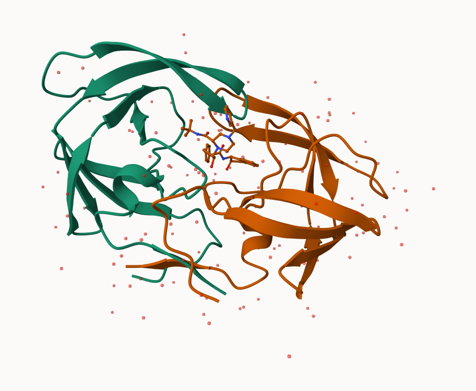
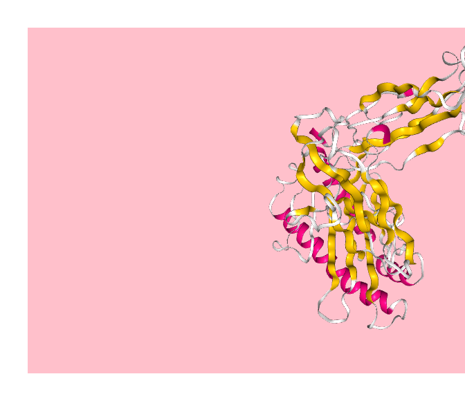
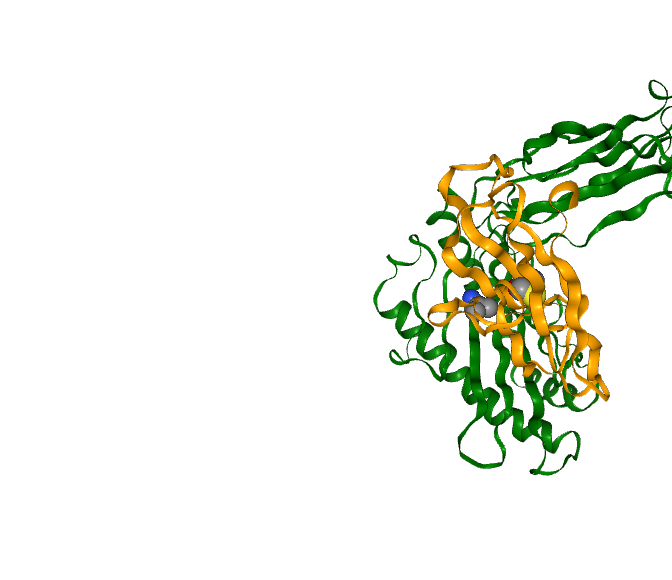
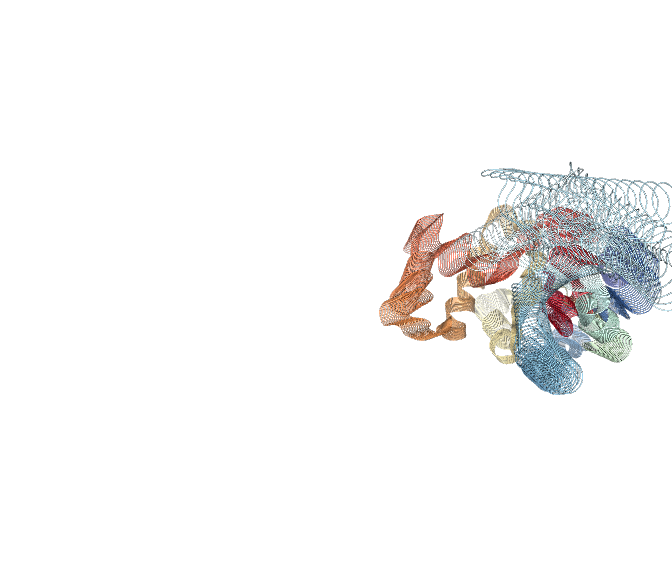

# Class 10: Structural Bionformatics 1
Christopher Levinger (A17390693)

- [PDB database](#pdb-database)
- [2. Visualizing with Mol-Star](#2-visualizing-with-mol-star)
- [3: Using the Bio3D package in R](#3-using-the-bio3d-package-in-r)
- [Molecular Visualization in R](#molecular-visualization-in-r)
- [Predicting Functional motions of a single
  structure](#predicting-functional-motions-of-a-single-structure)

## PDB database

The main repository of biomolecular structure data is called the
\[Protein Data Bank\] (https://www.rcsb.org/) (PDB for short). It is the
second oldest database (after GenBank).

``` r
result <- 202990/252188522*100
result
```

    [1] 0.08049137


    ::: {.cell}

    ```{.r .cell-code}
    stats <- read.csv("Data Export Summary .csv")
    stats

<div class="cell-output cell-output-stdout">

               Molecular.Type   X.ray     EM    NMR Multiple.methods Neutron Other
    1          Protein (only) 171,959 18,083 12,622              210      84    32
    2 Protein/Oligosaccharide  10,018  2,968     34               10       2     0
    3              Protein/NA   8,847  5,376    286                7       0     0
    4     Nucleic acid (only)   2,947    185  1,535               14       3     1
    5                   Other     170     10     33                0       0     0
    6  Oligosaccharide (only)      11      0      6                1       0     4
        Total
    1 202,990
    2  13,032
    3  14,516
    4   4,685
    5     213
    6      22

</div>

:::

``` r
x <- as.numeric(stats$xray)
```

``` r
x <- as.numeric(stats$xray)
x <- stats$X.ray
#Substitute coma for nothing 
as.numeric( gsub(",","",stats$X.ray))
```

    [1] 171959  10018   8847   2947    170     11

``` r
y <- gsub (",","",x)
```

Turn this into a function for any input x. Turn this snippet into a
function so I can use it any time I have this commma problem (i.e the
other columns of this `stats` table) \>Q1: What percentage of structures
in the PDB are solved by X-Ray and Electron Microscopy? According to the
results below, it was determined at 93.6787%

``` r
comma.sum <- function(x) {
  y <- gsub (",","",x)
sum(as.numeric( y ))
}
```

comma.sum \<- function(x) { y \<- gsub (“,”,““,x) sum(as.numeric( y ))

comma.sum \<- function(x) { x \<- as.character(x) y \<- gsub(“,”, ““, x)
y_numeric \<- as.numeric(y) sum(y_numeric, na.rm = TRUE)

``` r
xray.sum <- comma.sum(stats$X.ray)
em.sum <- comma.sum(stats$EM)
total.sum <- comma.sum(stats$Total)
xray.prop <- xray.sum / total.sum
```

``` r
f <- as.numeric(xray.sum/total.sum*100)
```

``` r
g <- em.sum/total.sum *100
```

``` r
f+g
```

    [1] 93.6787

> Q2: What proportion of structures in the PDB are protein? When
> considering only the protein only row of the dataframe, it yielded
> that 86.2107% of the structures were only composed of protein
> structures. When considering the rows that had protein elements in it,
> as in not just only protein, but also considering those structures
> with combinations of protein and nucleic acid and oligosaccharides,
> this yielded a much higher proportion of structures at 97.91046%.

``` r
z<- as.numeric(stats[which(stats$Type == "Protein (only)"), ])
```

``` r
a <- as.numeric(gsub(",", "", stats[1, 8]))
```

``` r
r <- gsub(",", "", stats$Total)
numeric_total <- as.numeric(r)
b <- sum(numeric_total, na.rm = TRUE)
b
```

    [1] 235458

``` r
a/b*100
```

    [1] 86.2107

``` r
a <- as.numeric(gsub(",", "", stats[1, 8]))
e <- as.numeric(gsub(",", "", stats[2, 8]))
f <- as.numeric(gsub(",", "", stats[3, 8]))
(a+e+f)/b *100
```

    [1] 97.91046

> Q3: Type HIV in the PDB website search box on the home page and
> determine how many HIV-1 protease structures are in the current PDB?
> (Skip Question 3) We were told to skip this question 3 even though it
> is part of the rubric.

## 2. Visualizing with Mol-Star

Explore the HIV-1 protease structure with PDB code: `1HSG`

 \>Q4: Water molecules
normally have 3 atoms. Why do we see just one atom per water molecule in
this structure? We only see one atom per water molecule in this
structure because the Hydrogen atoms are comparatively very small
compared to the much larger Oxygen atoms, thus the mol star website only
depicts the larger oxygen structure when displaying a water molecule.
\>Q5: There is a critical “conserved” water molecule in the binding
site. Can you identify this water molecule? What residue number does
this water molecule have? This water molecule can be identified as water
301. This water was key for inhibition and designing residues for
hydrogen binding for more effective blocking of the 1HSG protein
activity.


Paste ligand as ball and stick model in spacefill model with rest of
protein.


## 3: Using the Bio3D package in R

The Bio 3D package is focused on structural bionformatics analysis and
allows us to read and analyze PDB (and related) data.

``` r
library(bio3d)
```

``` r
pdb <- read.pdb("1HSB")
```

      Note: Accessing on-line PDB file

``` r
pdb
```


     Call:  read.pdb(file = "1HSB")

       Total Models#: 1
         Total Atoms#: 3327,  XYZs#: 9981  Chains#: 3  (values: A B C)

         Protein Atoms#: 3057  (residues/Calpha atoms#: 374)
         Nucleic acid Atoms#: 0  (residues/phosphate atoms#: 0)

         Non-protein/nucleic Atoms#: 270  (residues: 270)
         Non-protein/nucleic resid values: [ HOH (270) ]

       Protein sequence:
          GSHSMRYFYTSVSRPGRGEPRFIAVGYVDDTQFVRFDSDAASQRMEPRAPWIEQEGPEYW
          DRNTRNVKAQSQTDRVDLGTLRGYYNQSEAGSHTIQMMYGCDVGSDGRFLRGYRQDAYDG
          KDYIALKEDLRSWTAADMAAQTTKHKWEAAHVAEQWRAYLEGTCVEWLRRYLENGKETLQ
          RTDAPKTHMTHHAVSDHEATLRCWALSFYPAEITLTWQRDGEDQT...<cut>...VAAR

    + attr: atom, xyz, seqres, helix, sheet,
            calpha, remark, call

``` r
attributes(pdb)
```

    $names
    [1] "atom"   "xyz"    "seqres" "helix"  "sheet"  "calpha" "remark" "call"  

    $class
    [1] "pdb" "sse"

We can see atom data with pdb\$atom

``` r
head(pdb$atom)
```

      type eleno elety  alt resid chain resno insert      x      y       z o     b
    1 ATOM     1     N <NA>   GLY     A     1   <NA> 50.037 51.776 100.904 1 21.82
    2 ATOM     2    CA <NA>   GLY     A     1   <NA> 48.980 50.885 100.440 1 20.81
    3 ATOM     3     C <NA>   GLY     A     1   <NA> 49.326 49.556 101.036 1 20.29
    4 ATOM     4     O <NA>   GLY     A     1   <NA> 50.362 49.487 101.707 1 20.54
    5 ATOM     5     N <NA>   SER     A     2   <NA> 48.350 48.668 100.941 1 19.63
    6 ATOM     6    CA <NA>   SER     A     2   <NA> 48.486 47.273 101.301 1 18.77
      segid elesy charge
    1  <NA>     N   <NA>
    2  <NA>     C   <NA>
    3  <NA>     C   <NA>
    4  <NA>     O   <NA>
    5  <NA>     N   <NA>
    6  <NA>     C   <NA>

> Q7: How many amino acid residues are there in this pdb object? 198 Q8:
> Name one of the two non-protein residues? HOH Q9:How many protein
> chains are in this structure? 2 A and B

``` r
head(pdbseq(pdb) )
```

      1   2   3   4   5   6 
    "G" "S" "H" "S" "M" "R" 

## Molecular Visualization in R

We can make quick 3D viz with `view.pdb()` function:

``` r
#install.packages("pak")
#pak::pak("bioboot/bio3dview")
#install.packages("NGLVieweR")
#install.packages()

#library(bio3dview)
#library(NGLvieweR)

#view.pdb(pdb) |>
  #setSpin()
```

``` r
#install.packages("pak")
#pak::pak("bioboot/bio3dview")
#install.packages("NGLVieweR")
```

``` r
library(bio3dview)
library(NGLVieweR)
view.pdb(pdb, backgroundColor="pink", colorScheme="sse")
```

    PhantomJS not found. You can install it with webshot::install_phantomjs(). If it is installed, please make sure the phantomjs executable can be found via the PATH variable.

    file:////private/var/folders/m8/ndytkmz55395lwskyz8gkrsh0000gn/T/Rtmpl4JfAP/file127fa5829f379/widget127fa2a2fba27.html screenshot completed



``` r
sel <- atom.select(pdb, resno=25)

view.pdb(pdb, cols=c("green","orange"),
           highlight=sel,
        highlight.style="spacefill") |>
 setRock()
```

    Warning in view.pdb(pdb, cols = c("green", "orange"), highlight = sel,
    highlight.style = "spacefill"): Not enough distinct cols for each chain,
    recycling

    file:////private/var/folders/m8/ndytkmz55395lwskyz8gkrsh0000gn/T/Rtmpl4JfAP/file127fa37581876/widget127fa78ae075c.html screenshot completed



## Predicting Functional motions of a single structure

We can finish off today with a bionformatics prediction of the
functional motions of a protein.

We will run a Normal Mode Analysis (NMA)

``` r
adk <- read.pdb("6s36")
```

      Note: Accessing on-line PDB file
       PDB has ALT records, taking A only, rm.alt=TRUE

``` r
adk
```


     Call:  read.pdb(file = "6s36")

       Total Models#: 1
         Total Atoms#: 1898,  XYZs#: 5694  Chains#: 1  (values: A)

         Protein Atoms#: 1654  (residues/Calpha atoms#: 214)
         Nucleic acid Atoms#: 0  (residues/phosphate atoms#: 0)

         Non-protein/nucleic Atoms#: 244  (residues: 244)
         Non-protein/nucleic resid values: [ CL (3), HOH (238), MG (2), NA (1) ]

       Protein sequence:
          MRIILLGAPGAGKGTQAQFIMEKYGIPQISTGDMLRAAVKSGSELGKQAKDIMDAGKLVT
          DELVIALVKERIAQEDCRNGFLLDGFPRTIPQADAMKEAGINVDYVLEFDVPDELIVDKI
          VGRRVHAPSGRVYHVKFNPPKVEGKDDVTGEELTTRKDDQEETVRKRLVEYHQMTAPLIG
          YYSKEAEAGNTKYAKVDGTKPVAEVRADLEKILG

    + attr: atom, xyz, seqres, helix, sheet,
            calpha, remark, call

``` r
m <- nma(adk)
```

     Building Hessian...        Done in 0.014 seconds.
     Diagonalizing Hessian...   Done in 0.3 seconds.

``` r
plot(m)
```


``` r
view.nma(m)
```

    file:////private/var/folders/m8/ndytkmz55395lwskyz8gkrsh0000gn/T/Rtmpl4JfAP/file127fa2a2666ff/widget127fa3f3404f7.html screenshot completed



``` r
library(bio3d)
aa <- get.seq("1ake_A")
```

    Warning in get.seq("1ake_A"): Removing existing file: seqs.fasta

    Fetching... Please wait. Done.

``` r
aa
```

                 1        .         .         .         .         .         60 
    pdb|1AKE|A   MRIILLGAPGAGKGTQAQFIMEKYGIPQISTGDMLRAAVKSGSELGKQAKDIMDAGKLVT
                 1        .         .         .         .         .         60 

                61        .         .         .         .         .         120 
    pdb|1AKE|A   DELVIALVKERIAQEDCRNGFLLDGFPRTIPQADAMKEAGINVDYVLEFDVPDELIVDRI
                61        .         .         .         .         .         120 

               121        .         .         .         .         .         180 
    pdb|1AKE|A   VGRRVHAPSGRVYHVKFNPPKVEGKDDVTGEELTTRKDDQEETVRKRLVEYHQMTAPLIG
               121        .         .         .         .         .         180 

               181        .         .         .   214 
    pdb|1AKE|A   YYSKEAEAGNTKYAKVDGTKPVAEVRADLEKILG
               181        .         .         .   214 

    Call:
      read.fasta(file = outfile)

    Class:
      fasta

    Alignment dimensions:
      1 sequence rows; 214 position columns (214 non-gap, 0 gap) 

    + attr: id, ali, call

> Q10. Which of the packages above is found only on BioConductor and not
> CRAN? msa

> Q11. Which of the above packages is not found on BioConductor or
> CRAN?: bio3d-view

> Q12. True or False? Functions from the devtools package can be used to
> install packages from GitHub and BitBucket? TRUE

> Q13. How many amino acids are in this sequence, i.e. how long is this
> sequence? 214

We can write out a trajectory of the predicted dynamics and view this in
Molstar.

``` r
mktrj(m,file="nma.pdb")
```
