# Class 11 AlphaFold
Christopher Levinger (A17390693)

- [First part of Class: Structural Bionformatics
  2](#first-part-of-class-structural-bionformatics-2)
- [Beginning of Alpha Fold for Dimer
  Protein](#beginning-of-alpha-fold-for-dimer-protein)
- [Custom Analysis for Resulting
  Domains](#custom-analysis-for-resulting-domains)
- [Predicted Alignment Error for
  Domains](#predicted-alignment-error-for-domains)
- [Score Residue Conservation from alignment
  file](#score-residue-conservation-from-alignment-file)
- [Residue Conservation for Alignment
  File](#residue-conservation-for-alignment-file)
- [Find a gene project alpha fold
  continuation](#find-a-gene-project-alpha-fold-continuation)
- [Custom Analysis of Resulting Models: Find a Gene
  Project](#custom-analysis-of-resulting-models-find-a-gene-project)

## First part of Class: Structural Bionformatics 2

Load up the packages we will need for analysis of protein structure
sets.

``` r
library(bio3d)
```

install.packages(“BiocManager”) BiocManager::install(“msa”) These above
packages were already previously installed.

We will analyze the ADK family with a single ADK database accession
code: “1ake_A”

``` r
id <- "1ake_A"
aa <- get.seq(id)
```

    Warning in get.seq(id): Removing existing file: seqs.fasta

    Fetching... Please wait. Done.

``` r
aa
```

                 1        .         .         .         .         .         60 
    pdb|1AKE|A   MRIILLGAPGAGKGTQAQFIMEKYGIPQISTGDMLRAAVKSGSELGKQAKDIMDAGKLVT
                 1        .         .         .         .         .         60 

                61        .         .         .         .         .         120 
    pdb|1AKE|A   DELVIALVKERIAQEDCRNGFLLDGFPRTIPQADAMKEAGINVDYVLEFDVPDELIVDRI
                61        .         .         .         .         .         120 

               121        .         .         .         .         .         180 
    pdb|1AKE|A   VGRRVHAPSGRVYHVKFNPPKVEGKDDVTGEELTTRKDDQEETVRKRLVEYHQMTAPLIG
               121        .         .         .         .         .         180 

               181        .         .         .   214 
    pdb|1AKE|A   YYSKEAEAGNTKYAKVDGTKPVAEVRADLEKILG
               181        .         .         .   214 

    Call:
      read.fasta(file = outfile)

    Class:
      fasta

    Alignment dimensions:
      1 sequence rows; 214 position columns (214 non-gap, 0 gap) 

    + attr: id, ali, call

We can search the PDB database to find all related entries.

``` r
blast <- blast.pdb(aa)
```

     Searching ... please wait (updates every 5 seconds) RID = 43W26DYX013 
     .
     Reporting 91 hits

``` r
attributes(blast)
```

    $names
    [1] "hit.tbl" "raw"     "url"    

    $class
    [1] "blast"

``` r
head(blast$hit.tbl)
```

            queryid subjectids identity alignmentlength mismatches gapopens q.start
    1 Query_1220507     1AKE_A  100.000             214          0        0       1
    2 Query_1220507     8BQF_A   99.533             214          1        0       1
    3 Query_1220507     4X8M_A   99.533             214          1        0       1
    4 Query_1220507     6S36_A   99.533             214          1        0       1
    5 Query_1220507     8Q2B_A   99.533             214          1        0       1
    6 Query_1220507     8RJ9_A   99.533             214          1        0       1
      q.end s.start s.end    evalue bitscore positives mlog.evalue pdb.id    acc
    1   214       1   214 1.67e-156      432    100.00    358.6905 1AKE_A 1AKE_A
    2   214      21   234 2.73e-156      433    100.00    358.1990 8BQF_A 8BQF_A
    3   214       1   214 2.98e-156      432    100.00    358.1114 4X8M_A 4X8M_A
    4   214       1   214 4.38e-156      432    100.00    357.7262 6S36_A 6S36_A
    5   214       1   214 1.16e-155      431     99.53    356.7523 8Q2B_A 8Q2B_A
    6   214       1   214 1.16e-155      431     99.53    356.7523 8RJ9_A 8RJ9_A

Make a little summary figure of these results:

``` r
hits <- plot(blast)
```

      * Possible cutoff values:    260 3 
                Yielding Nhits:    18 91 

      * Chosen cutoff value of:    260 
                Yielding Nhits:    18 


Our “top hits” i.e the most similar entries in the database are:

``` r
hits$pdb.id
```

     [1] "1AKE_A" "8BQF_A" "4X8M_A" "6S36_A" "8Q2B_A" "8RJ9_A" "6RZE_A" "4X8H_A"
     [9] "3HPR_A" "1E4V_A" "5EJE_A" "1E4Y_A" "3X2S_A" "6HAP_A" "6HAM_A" "8PVW_A"
    [17] "4K46_A" "4NP6_A"

``` r
#Downoload related pdb files
files <- get.pdb(hits$pdb.id, path="pdbs", split=TRUE, gzip=TRUE)
```

    Warning in get.pdb(hits$pdb.id, path = "pdbs", split = TRUE, gzip = TRUE):
    pdbs/1AKE.pdb.gz exists. Skipping download

    Warning in get.pdb(hits$pdb.id, path = "pdbs", split = TRUE, gzip = TRUE):
    pdbs/8BQF.pdb.gz exists. Skipping download

    Warning in get.pdb(hits$pdb.id, path = "pdbs", split = TRUE, gzip = TRUE):
    pdbs/4X8M.pdb.gz exists. Skipping download

    Warning in get.pdb(hits$pdb.id, path = "pdbs", split = TRUE, gzip = TRUE):
    pdbs/6S36.pdb.gz exists. Skipping download

    Warning in get.pdb(hits$pdb.id, path = "pdbs", split = TRUE, gzip = TRUE):
    pdbs/8Q2B.pdb.gz exists. Skipping download

    Warning in get.pdb(hits$pdb.id, path = "pdbs", split = TRUE, gzip = TRUE):
    pdbs/8RJ9.pdb.gz exists. Skipping download

    Warning in get.pdb(hits$pdb.id, path = "pdbs", split = TRUE, gzip = TRUE):
    pdbs/6RZE.pdb.gz exists. Skipping download

    Warning in get.pdb(hits$pdb.id, path = "pdbs", split = TRUE, gzip = TRUE):
    pdbs/4X8H.pdb.gz exists. Skipping download

    Warning in get.pdb(hits$pdb.id, path = "pdbs", split = TRUE, gzip = TRUE):
    pdbs/3HPR.pdb.gz exists. Skipping download

    Warning in get.pdb(hits$pdb.id, path = "pdbs", split = TRUE, gzip = TRUE):
    pdbs/1E4V.pdb.gz exists. Skipping download

    Warning in get.pdb(hits$pdb.id, path = "pdbs", split = TRUE, gzip = TRUE):
    pdbs/5EJE.pdb.gz exists. Skipping download

    Warning in get.pdb(hits$pdb.id, path = "pdbs", split = TRUE, gzip = TRUE):
    pdbs/1E4Y.pdb.gz exists. Skipping download

    Warning in get.pdb(hits$pdb.id, path = "pdbs", split = TRUE, gzip = TRUE):
    pdbs/3X2S.pdb.gz exists. Skipping download

    Warning in get.pdb(hits$pdb.id, path = "pdbs", split = TRUE, gzip = TRUE):
    pdbs/6HAP.pdb.gz exists. Skipping download

    Warning in get.pdb(hits$pdb.id, path = "pdbs", split = TRUE, gzip = TRUE):
    pdbs/6HAM.pdb.gz exists. Skipping download

    Warning in get.pdb(hits$pdb.id, path = "pdbs", split = TRUE, gzip = TRUE):
    pdbs/8PVW.pdb.gz exists. Skipping download

    Warning in get.pdb(hits$pdb.id, path = "pdbs", split = TRUE, gzip = TRUE):
    pdbs/4K46.pdb.gz exists. Skipping download

    Warning in get.pdb(hits$pdb.id, path = "pdbs", split = TRUE, gzip = TRUE):
    pdbs/4NP6.pdb.gz exists. Skipping download


      |                                                                            
      |                                                                      |   0%
      |                                                                            
      |====                                                                  |   6%
      |                                                                            
      |========                                                              |  11%
      |                                                                            
      |============                                                          |  17%
      |                                                                            
      |================                                                      |  22%
      |                                                                            
      |===================                                                   |  28%
      |                                                                            
      |=======================                                               |  33%
      |                                                                            
      |===========================                                           |  39%
      |                                                                            
      |===============================                                       |  44%
      |                                                                            
      |===================================                                   |  50%
      |                                                                            
      |=======================================                               |  56%
      |                                                                            
      |===========================================                           |  61%
      |                                                                            
      |===============================================                       |  67%
      |                                                                            
      |===================================================                   |  72%
      |                                                                            
      |======================================================                |  78%
      |                                                                            
      |==========================================================            |  83%
      |                                                                            
      |==============================================================        |  89%
      |                                                                            
      |==================================================================    |  94%
      |                                                                            
      |======================================================================| 100%

``` r
# Align releated PDBs
pdbs <- pdbaln(files, fit = TRUE, exefile="msa")
```

    Reading PDB files:
    pdbs/split_chain/1AKE_A.pdb
    pdbs/split_chain/8BQF_A.pdb
    pdbs/split_chain/4X8M_A.pdb
    pdbs/split_chain/6S36_A.pdb
    pdbs/split_chain/8Q2B_A.pdb
    pdbs/split_chain/8RJ9_A.pdb
    pdbs/split_chain/6RZE_A.pdb
    pdbs/split_chain/4X8H_A.pdb
    pdbs/split_chain/3HPR_A.pdb
    pdbs/split_chain/1E4V_A.pdb
    pdbs/split_chain/5EJE_A.pdb
    pdbs/split_chain/1E4Y_A.pdb
    pdbs/split_chain/3X2S_A.pdb
    pdbs/split_chain/6HAP_A.pdb
    pdbs/split_chain/6HAM_A.pdb
    pdbs/split_chain/8PVW_A.pdb
    pdbs/split_chain/4K46_A.pdb
    pdbs/split_chain/4NP6_A.pdb
       PDB has ALT records, taking A only, rm.alt=TRUE
    .   PDB has ALT records, taking A only, rm.alt=TRUE
    ..   PDB has ALT records, taking A only, rm.alt=TRUE
    .   PDB has ALT records, taking A only, rm.alt=TRUE
    .   PDB has ALT records, taking A only, rm.alt=TRUE
    .   PDB has ALT records, taking A only, rm.alt=TRUE
    ..   PDB has ALT records, taking A only, rm.alt=TRUE
    ..   PDB has ALT records, taking A only, rm.alt=TRUE
    ....   PDB has ALT records, taking A only, rm.alt=TRUE
    .   PDB has ALT records, taking A only, rm.alt=TRUE
    .   PDB has ALT records, taking A only, rm.alt=TRUE
    ..

    Extracting sequences

    pdb/seq: 1   name: pdbs/split_chain/1AKE_A.pdb 
       PDB has ALT records, taking A only, rm.alt=TRUE
    pdb/seq: 2   name: pdbs/split_chain/8BQF_A.pdb 
       PDB has ALT records, taking A only, rm.alt=TRUE
    pdb/seq: 3   name: pdbs/split_chain/4X8M_A.pdb 
    pdb/seq: 4   name: pdbs/split_chain/6S36_A.pdb 
       PDB has ALT records, taking A only, rm.alt=TRUE
    pdb/seq: 5   name: pdbs/split_chain/8Q2B_A.pdb 
       PDB has ALT records, taking A only, rm.alt=TRUE
    pdb/seq: 6   name: pdbs/split_chain/8RJ9_A.pdb 
       PDB has ALT records, taking A only, rm.alt=TRUE
    pdb/seq: 7   name: pdbs/split_chain/6RZE_A.pdb 
       PDB has ALT records, taking A only, rm.alt=TRUE
    pdb/seq: 8   name: pdbs/split_chain/4X8H_A.pdb 
    pdb/seq: 9   name: pdbs/split_chain/3HPR_A.pdb 
       PDB has ALT records, taking A only, rm.alt=TRUE
    pdb/seq: 10   name: pdbs/split_chain/1E4V_A.pdb 
    pdb/seq: 11   name: pdbs/split_chain/5EJE_A.pdb 
       PDB has ALT records, taking A only, rm.alt=TRUE
    pdb/seq: 12   name: pdbs/split_chain/1E4Y_A.pdb 
    pdb/seq: 13   name: pdbs/split_chain/3X2S_A.pdb 
    pdb/seq: 14   name: pdbs/split_chain/6HAP_A.pdb 
    pdb/seq: 15   name: pdbs/split_chain/6HAM_A.pdb 
       PDB has ALT records, taking A only, rm.alt=TRUE
    pdb/seq: 16   name: pdbs/split_chain/8PVW_A.pdb 
       PDB has ALT records, taking A only, rm.alt=TRUE
    pdb/seq: 17   name: pdbs/split_chain/4K46_A.pdb 
       PDB has ALT records, taking A only, rm.alt=TRUE
    pdb/seq: 18   name: pdbs/split_chain/4NP6_A.pdb 

Align and superimpose all these structures:

Sidenote:

``` r
library(bio3dview)

view.pdbs(pdbs)
```

    PhantomJS not found. You can install it with webshot::install_phantomjs(). If it is installed, please make sure the phantomjs executable can be found via the PATH variable.

    file:////private/var/folders/m8/ndytkmz55395lwskyz8gkrsh0000gn/T/RtmppZNKw3/file1297570d0778a/widget129756583ee3.html screenshot completed

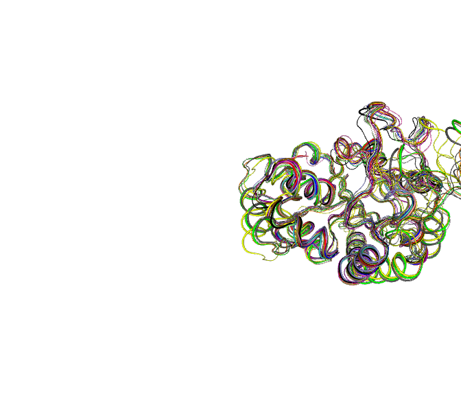

This is better but still difficult to see what is similar and different
in all these structures or indeed learn much about how this family
works.

Let’s try PCA:

``` r
pc <- pca(pdbs)
plot(pc)
```

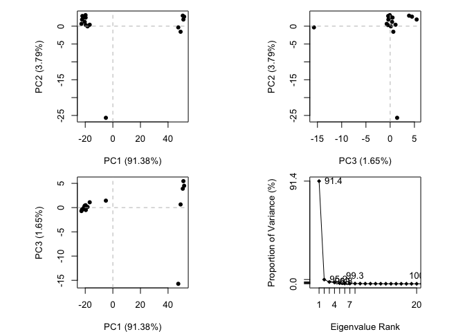

``` r
plot(pc, pc.axes=1:2)
```


``` r
view.pca(pc)
```

    file:////private/var/folders/m8/ndytkmz55395lwskyz8gkrsh0000gn/T/RtmppZNKw3/file1297586b0b41/widget129752bafdcb8.html screenshot completed

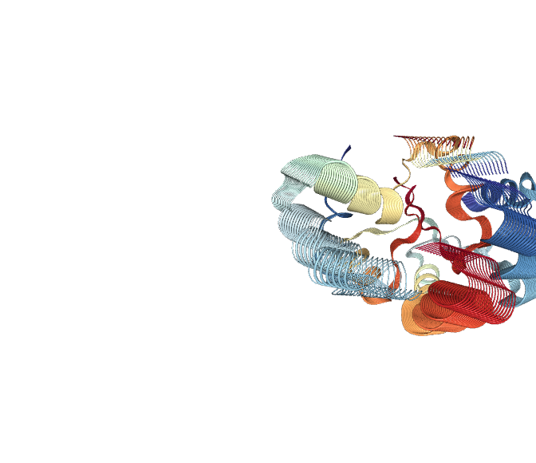

Write a PDB “trajectory” for mol-star

``` r
mktrj(pc, file="pca_results.pdb")
```

Allow for downloading of results

## Beginning of Alpha Fold for Dimer Protein

``` r
library(bio3d)

pth <- "dimer_23119_1/"
pdb.files <- list.files(path=pth, full.names=TRUE, pattern= ".pdb")
```

Align and superimpose all these models.

``` r
file.exists(pdb.files)
```

    [1] TRUE TRUE TRUE TRUE TRUE

``` r
pdbs <- pdbaln(pdb.files, fit=TRUE, exefile="msa")
```

    Reading PDB files:
    dimer_23119_1//dimer_23119_1_unrelaxed_rank_001_alphafold2_multimer_v3_model_2_seed_000.pdb
    dimer_23119_1//dimer_23119_1_unrelaxed_rank_002_alphafold2_multimer_v3_model_5_seed_000.pdb
    dimer_23119_1//dimer_23119_1_unrelaxed_rank_003_alphafold2_multimer_v3_model_4_seed_000.pdb
    dimer_23119_1//dimer_23119_1_unrelaxed_rank_004_alphafold2_multimer_v3_model_1_seed_000.pdb
    dimer_23119_1//dimer_23119_1_unrelaxed_rank_005_alphafold2_multimer_v3_model_3_seed_000.pdb
    .....

    Extracting sequences

    pdb/seq: 1   name: dimer_23119_1//dimer_23119_1_unrelaxed_rank_001_alphafold2_multimer_v3_model_2_seed_000.pdb 
    pdb/seq: 2   name: dimer_23119_1//dimer_23119_1_unrelaxed_rank_002_alphafold2_multimer_v3_model_5_seed_000.pdb 
    pdb/seq: 3   name: dimer_23119_1//dimer_23119_1_unrelaxed_rank_003_alphafold2_multimer_v3_model_4_seed_000.pdb 
    pdb/seq: 4   name: dimer_23119_1//dimer_23119_1_unrelaxed_rank_004_alphafold2_multimer_v3_model_1_seed_000.pdb 
    pdb/seq: 5   name: dimer_23119_1//dimer_23119_1_unrelaxed_rank_005_alphafold2_multimer_v3_model_3_seed_000.pdb 

``` r
library(bio3dview)
view.pdbs(pdbs)
```

    file:////private/var/folders/m8/ndytkmz55395lwskyz8gkrsh0000gn/T/RtmppZNKw3/file1297544d70b83/widget12975234e8c4.html screenshot completed

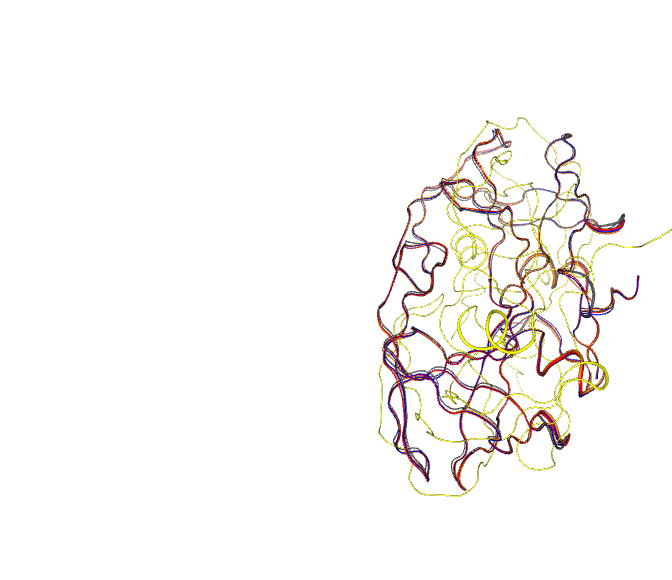

High pldt scores above 70 are good. y-axis is pldt score x-axis is amino
acid. Low paes plots are good.

``` r
plot(pdbs$b[1,], typ="l", ylim=c(0,100))
lines(pdbs$b[5,], typ="l", col="red")
lines(pdbs$b[3,], typ="l", col="green")
```

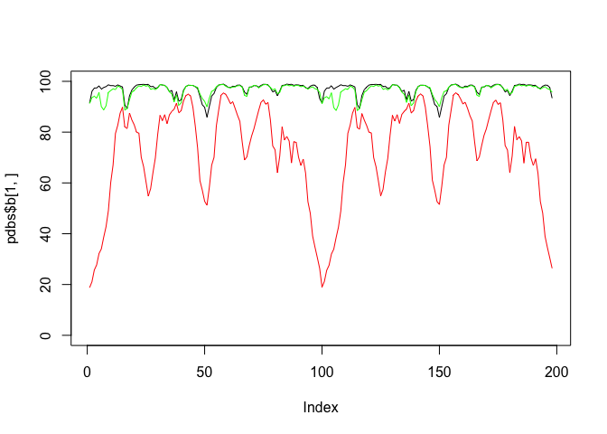

``` r
core <- core.find(pdbs)
```

     core size 197 of 198  vol = 32.323 
     core size 196 of 198  vol = 28.916 
     core size 195 of 198  vol = 27.276 
     core size 194 of 198  vol = 25.733 
     core size 193 of 198  vol = 24.724 
     core size 192 of 198  vol = 23.805 
     core size 191 of 198  vol = 23.128 
     core size 190 of 198  vol = 22.502 
     core size 189 of 198  vol = 21.867 
     core size 188 of 198  vol = 21.293 
     core size 187 of 198  vol = 20.774 
     core size 186 of 198  vol = 20.305 
     core size 185 of 198  vol = 19.783 
     core size 184 of 198  vol = 19.353 
     core size 183 of 198  vol = 18.94 
     core size 182 of 198  vol = 18.539 
     core size 181 of 198  vol = 18.097 
     core size 180 of 198  vol = 17.694 
     core size 179 of 198  vol = 17.257 
     core size 178 of 198  vol = 16.867 
     core size 177 of 198  vol = 16.519 
     core size 176 of 198  vol = 16.237 
     core size 175 of 198  vol = 15.978 
     core size 174 of 198  vol = 15.693 
     core size 173 of 198  vol = 15.412 
     core size 172 of 198  vol = 15.174 
     core size 171 of 198  vol = 14.957 
     core size 170 of 198  vol = 14.733 
     core size 169 of 198  vol = 14.532 
     core size 168 of 198  vol = 14.363 
     core size 167 of 198  vol = 14.222 
     core size 166 of 198  vol = 13.981 
     core size 165 of 198  vol = 13.885 
     core size 164 of 198  vol = 13.822 
     core size 163 of 198  vol = 13.736 
     core size 162 of 198  vol = 13.646 
     core size 161 of 198  vol = 13.58 
     core size 160 of 198  vol = 13.46 
     core size 159 of 198  vol = 13.261 
     core size 158 of 198  vol = 13.076 
     core size 157 of 198  vol = 12.91 
     core size 156 of 198  vol = 12.971 
     core size 155 of 198  vol = 12.926 
     core size 154 of 198  vol = 12.892 
     core size 153 of 198  vol = 12.769 
     core size 152 of 198  vol = 12.648 
     core size 151 of 198  vol = 12.53 
     core size 150 of 198  vol = 12.326 
     core size 149 of 198  vol = 12.104 
     core size 148 of 198  vol = 11.905 
     core size 147 of 198  vol = 11.473 
     core size 146 of 198  vol = 11.155 
     core size 145 of 198  vol = 10.956 
     core size 144 of 198  vol = 10.755 
     core size 143 of 198  vol = 10.546 
     core size 142 of 198  vol = 10.276 
     core size 141 of 198  vol = 10.066 
     core size 140 of 198  vol = 9.835 
     core size 139 of 198  vol = 9.619 
     core size 138 of 198  vol = 9.405 
     core size 137 of 198  vol = 9.142 
     core size 136 of 198  vol = 8.863 
     core size 135 of 198  vol = 8.526 
     core size 134 of 198  vol = 8.229 
     core size 133 of 198  vol = 7.998 
     core size 132 of 198  vol = 7.809 
     core size 131 of 198  vol = 7.509 
     core size 130 of 198  vol = 7.288 
     core size 129 of 198  vol = 7.084 
     core size 128 of 198  vol = 6.88 
     core size 127 of 198  vol = 6.59 
     core size 126 of 198  vol = 6.38 
     core size 125 of 198  vol = 6.197 
     core size 124 of 198  vol = 5.976 
     core size 123 of 198  vol = 5.764 
     core size 122 of 198  vol = 5.568 
     core size 121 of 198  vol = 5.312 
     core size 120 of 198  vol = 5.021 
     core size 119 of 198  vol = 4.758 
     core size 118 of 198  vol = 4.501 
     core size 117 of 198  vol = 4.218 
     core size 116 of 198  vol = 4.031 
     core size 115 of 198  vol = 3.801 
     core size 114 of 198  vol = 3.604 
     core size 113 of 198  vol = 3.379 
     core size 112 of 198  vol = 3.183 
     core size 111 of 198  vol = 3.002 
     core size 110 of 198  vol = 2.79 
     core size 109 of 198  vol = 2.603 
     core size 108 of 198  vol = 2.508 
     core size 107 of 198  vol = 2.421 
     core size 106 of 198  vol = 2.24 
     core size 105 of 198  vol = 2.084 
     core size 104 of 198  vol = 1.945 
     core size 103 of 198  vol = 1.832 
     core size 102 of 198  vol = 1.659 
     core size 101 of 198  vol = 1.582 
     core size 100 of 198  vol = 1.483 
     core size 99 of 198  vol = 1.382 
     core size 98 of 198  vol = 1.331 
     core size 97 of 198  vol = 1.264 
     core size 96 of 198  vol = 1.137 
     core size 95 of 198  vol = 1.043 
     core size 94 of 198  vol = 0.957 
     core size 93 of 198  vol = 0.885 
     core size 92 of 198  vol = 0.803 
     core size 91 of 198  vol = 0.73 
     core size 90 of 198  vol = 0.637 
     core size 89 of 198  vol = 0.56 
     core size 88 of 198  vol = 0.489 
     FINISHED: Min vol ( 0.5 ) reached

``` r
core.inds <- print(core, vol=0.5)
```

    # 89 positions (cumulative volume <= 0.5 Angstrom^3) 
      start end length
    1    10  42     33
    2    44  50      7
    3    52  66     15
    4    69  77      9
    5    80  98     19

``` r
xyz <- pdbfit(pdbs, core.inds, outpath="corefit_structures")
```

``` r
rf <- rmsf(xyz)

plotb3(rf,)
abline(v=100, col="gray", ylab="RMSF")
```

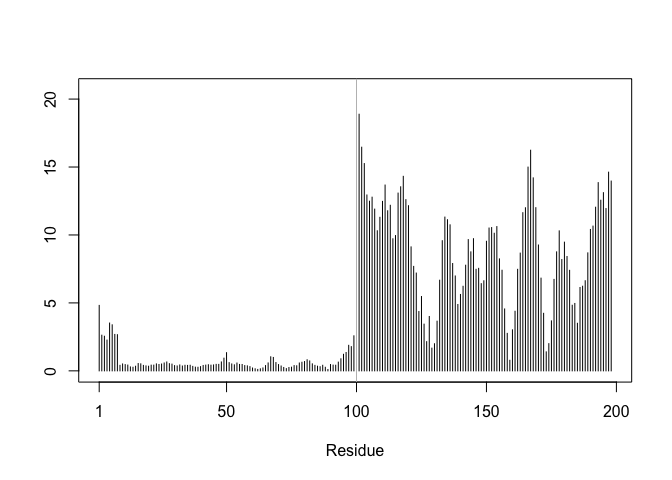

## Custom Analysis for Resulting Domains

``` r
results_dir <- "dimer_23119_1" 
```

``` r
pdb_files <- list.files(path=results_dir,
                        pattern="*.pdb",
                        full.names = TRUE)
basename(pdb.files)
```

    [1] "dimer_23119_1_unrelaxed_rank_001_alphafold2_multimer_v3_model_2_seed_000.pdb"
    [2] "dimer_23119_1_unrelaxed_rank_002_alphafold2_multimer_v3_model_5_seed_000.pdb"
    [3] "dimer_23119_1_unrelaxed_rank_003_alphafold2_multimer_v3_model_4_seed_000.pdb"
    [4] "dimer_23119_1_unrelaxed_rank_004_alphafold2_multimer_v3_model_1_seed_000.pdb"
    [5] "dimer_23119_1_unrelaxed_rank_005_alphafold2_multimer_v3_model_3_seed_000.pdb"

``` r
library(bio3d)
pdbs <- pdbaln(pdb_files, fit=TRUE, exefile="msa")
```

    Reading PDB files:
    dimer_23119_1/dimer_23119_1_unrelaxed_rank_001_alphafold2_multimer_v3_model_2_seed_000.pdb
    dimer_23119_1/dimer_23119_1_unrelaxed_rank_002_alphafold2_multimer_v3_model_5_seed_000.pdb
    dimer_23119_1/dimer_23119_1_unrelaxed_rank_003_alphafold2_multimer_v3_model_4_seed_000.pdb
    dimer_23119_1/dimer_23119_1_unrelaxed_rank_004_alphafold2_multimer_v3_model_1_seed_000.pdb
    dimer_23119_1/dimer_23119_1_unrelaxed_rank_005_alphafold2_multimer_v3_model_3_seed_000.pdb
    .....

    Extracting sequences

    pdb/seq: 1   name: dimer_23119_1/dimer_23119_1_unrelaxed_rank_001_alphafold2_multimer_v3_model_2_seed_000.pdb 
    pdb/seq: 2   name: dimer_23119_1/dimer_23119_1_unrelaxed_rank_002_alphafold2_multimer_v3_model_5_seed_000.pdb 
    pdb/seq: 3   name: dimer_23119_1/dimer_23119_1_unrelaxed_rank_003_alphafold2_multimer_v3_model_4_seed_000.pdb 
    pdb/seq: 4   name: dimer_23119_1/dimer_23119_1_unrelaxed_rank_004_alphafold2_multimer_v3_model_1_seed_000.pdb 
    pdb/seq: 5   name: dimer_23119_1/dimer_23119_1_unrelaxed_rank_005_alphafold2_multimer_v3_model_3_seed_000.pdb 

``` r
pdbs
```

                                   1        .         .         .         .         50 
    [Truncated_Name:1]dimer_2311   PQITLWQRPLVTIKIGGQLKEALLDTGADDTVLEEMSLPGRWKPKMIGGI
    [Truncated_Name:2]dimer_2311   PQITLWQRPLVTIKIGGQLKEALLDTGADDTVLEEMSLPGRWKPKMIGGI
    [Truncated_Name:3]dimer_2311   PQITLWQRPLVTIKIGGQLKEALLDTGADDTVLEEMSLPGRWKPKMIGGI
    [Truncated_Name:4]dimer_2311   PQITLWQRPLVTIKIGGQLKEALLDTGADDTVLEEMSLPGRWKPKMIGGI
    [Truncated_Name:5]dimer_2311   PQITLWQRPLVTIKIGGQLKEALLDTGADDTVLEEMSLPGRWKPKMIGGI
                                   ************************************************** 
                                   1        .         .         .         .         50 

                                  51        .         .         .         .         100 
    [Truncated_Name:1]dimer_2311   GGFIKVRQYDQILIEICGHKAIGTVLVGPTPVNIIGRNLLTQIGCTLNFP
    [Truncated_Name:2]dimer_2311   GGFIKVRQYDQILIEICGHKAIGTVLVGPTPVNIIGRNLLTQIGCTLNFP
    [Truncated_Name:3]dimer_2311   GGFIKVRQYDQILIEICGHKAIGTVLVGPTPVNIIGRNLLTQIGCTLNFP
    [Truncated_Name:4]dimer_2311   GGFIKVRQYDQILIEICGHKAIGTVLVGPTPVNIIGRNLLTQIGCTLNFP
    [Truncated_Name:5]dimer_2311   GGFIKVRQYDQILIEICGHKAIGTVLVGPTPVNIIGRNLLTQIGCTLNFP
                                   ************************************************** 
                                  51        .         .         .         .         100 

                                 101        .         .         .         .         150 
    [Truncated_Name:1]dimer_2311   QITLWQRPLVTIKIGGQLKEALLDTGADDTVLEEMSLPGRWKPKMIGGIG
    [Truncated_Name:2]dimer_2311   QITLWQRPLVTIKIGGQLKEALLDTGADDTVLEEMSLPGRWKPKMIGGIG
    [Truncated_Name:3]dimer_2311   QITLWQRPLVTIKIGGQLKEALLDTGADDTVLEEMSLPGRWKPKMIGGIG
    [Truncated_Name:4]dimer_2311   QITLWQRPLVTIKIGGQLKEALLDTGADDTVLEEMSLPGRWKPKMIGGIG
    [Truncated_Name:5]dimer_2311   QITLWQRPLVTIKIGGQLKEALLDTGADDTVLEEMSLPGRWKPKMIGGIG
                                   ************************************************** 
                                 101        .         .         .         .         150 

                                 151        .         .         .         .       198 
    [Truncated_Name:1]dimer_2311   GFIKVRQYDQILIEICGHKAIGTVLVGPTPVNIIGRNLLTQIGCTLNF
    [Truncated_Name:2]dimer_2311   GFIKVRQYDQILIEICGHKAIGTVLVGPTPVNIIGRNLLTQIGCTLNF
    [Truncated_Name:3]dimer_2311   GFIKVRQYDQILIEICGHKAIGTVLVGPTPVNIIGRNLLTQIGCTLNF
    [Truncated_Name:4]dimer_2311   GFIKVRQYDQILIEICGHKAIGTVLVGPTPVNIIGRNLLTQIGCTLNF
    [Truncated_Name:5]dimer_2311   GFIKVRQYDQILIEICGHKAIGTVLVGPTPVNIIGRNLLTQIGCTLNF
                                   ************************************************ 
                                 151        .         .         .         .       198 

    Call:
      pdbaln(files = pdb_files, fit = TRUE, exefile = "msa")

    Class:
      pdbs, fasta

    Alignment dimensions:
      5 sequence rows; 198 position columns (198 non-gap, 0 gap) 

    + attr: xyz, resno, b, chain, id, ali, resid, sse, call

``` r
rd <- rmsd(pdbs, fit=T)
```

    Warning in rmsd(pdbs, fit = T): No indices provided, using the 198 non NA positions

``` r
range(rd)
```

    [1]  0.000 13.406

``` r
library(pheatmap)

colnames(rd) <- paste0("m",1:5)
rownames(rd) <- paste0("m",1:5)
pheatmap(rd)
```

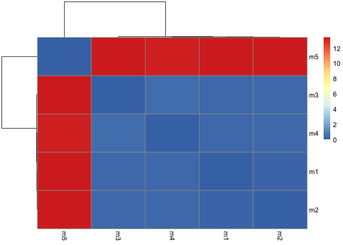

``` r
pdb <- read.pdb("1hsg")
```

      Note: Accessing on-line PDB file

``` r
plotb3(pdbs$b[1,], typ="l", lwd=2, sse=pdb)
points(pdbs$b[2,], typ="l", col="red")
points(pdbs$b[3,], typ="l", col="blue")
points(pdbs$b[4,], typ="l", col="darkgreen")
points(pdbs$b[5,], typ="l", col="orange")
abline(v=100, col="gray")
```

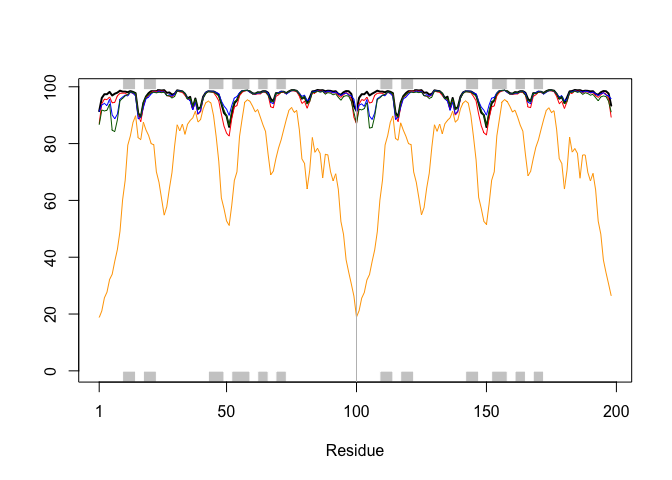

``` r
core <- core.find(pdbs)
```

     core size 197 of 198  vol = 32.323 
     core size 196 of 198  vol = 28.916 
     core size 195 of 198  vol = 27.276 
     core size 194 of 198  vol = 25.733 
     core size 193 of 198  vol = 24.724 
     core size 192 of 198  vol = 23.805 
     core size 191 of 198  vol = 23.128 
     core size 190 of 198  vol = 22.502 
     core size 189 of 198  vol = 21.867 
     core size 188 of 198  vol = 21.293 
     core size 187 of 198  vol = 20.774 
     core size 186 of 198  vol = 20.305 
     core size 185 of 198  vol = 19.783 
     core size 184 of 198  vol = 19.353 
     core size 183 of 198  vol = 18.94 
     core size 182 of 198  vol = 18.539 
     core size 181 of 198  vol = 18.097 
     core size 180 of 198  vol = 17.694 
     core size 179 of 198  vol = 17.257 
     core size 178 of 198  vol = 16.867 
     core size 177 of 198  vol = 16.519 
     core size 176 of 198  vol = 16.237 
     core size 175 of 198  vol = 15.978 
     core size 174 of 198  vol = 15.693 
     core size 173 of 198  vol = 15.412 
     core size 172 of 198  vol = 15.174 
     core size 171 of 198  vol = 14.957 
     core size 170 of 198  vol = 14.733 
     core size 169 of 198  vol = 14.532 
     core size 168 of 198  vol = 14.363 
     core size 167 of 198  vol = 14.222 
     core size 166 of 198  vol = 13.981 
     core size 165 of 198  vol = 13.885 
     core size 164 of 198  vol = 13.822 
     core size 163 of 198  vol = 13.736 
     core size 162 of 198  vol = 13.646 
     core size 161 of 198  vol = 13.58 
     core size 160 of 198  vol = 13.46 
     core size 159 of 198  vol = 13.261 
     core size 158 of 198  vol = 13.076 
     core size 157 of 198  vol = 12.91 
     core size 156 of 198  vol = 12.971 
     core size 155 of 198  vol = 12.926 
     core size 154 of 198  vol = 12.892 
     core size 153 of 198  vol = 12.769 
     core size 152 of 198  vol = 12.648 
     core size 151 of 198  vol = 12.53 
     core size 150 of 198  vol = 12.326 
     core size 149 of 198  vol = 12.104 
     core size 148 of 198  vol = 11.905 
     core size 147 of 198  vol = 11.473 
     core size 146 of 198  vol = 11.155 
     core size 145 of 198  vol = 10.956 
     core size 144 of 198  vol = 10.755 
     core size 143 of 198  vol = 10.546 
     core size 142 of 198  vol = 10.276 
     core size 141 of 198  vol = 10.066 
     core size 140 of 198  vol = 9.835 
     core size 139 of 198  vol = 9.619 
     core size 138 of 198  vol = 9.405 
     core size 137 of 198  vol = 9.142 
     core size 136 of 198  vol = 8.863 
     core size 135 of 198  vol = 8.526 
     core size 134 of 198  vol = 8.229 
     core size 133 of 198  vol = 7.998 
     core size 132 of 198  vol = 7.809 
     core size 131 of 198  vol = 7.509 
     core size 130 of 198  vol = 7.288 
     core size 129 of 198  vol = 7.084 
     core size 128 of 198  vol = 6.88 
     core size 127 of 198  vol = 6.59 
     core size 126 of 198  vol = 6.38 
     core size 125 of 198  vol = 6.197 
     core size 124 of 198  vol = 5.976 
     core size 123 of 198  vol = 5.764 
     core size 122 of 198  vol = 5.568 
     core size 121 of 198  vol = 5.312 
     core size 120 of 198  vol = 5.021 
     core size 119 of 198  vol = 4.758 
     core size 118 of 198  vol = 4.501 
     core size 117 of 198  vol = 4.218 
     core size 116 of 198  vol = 4.031 
     core size 115 of 198  vol = 3.801 
     core size 114 of 198  vol = 3.604 
     core size 113 of 198  vol = 3.379 
     core size 112 of 198  vol = 3.183 
     core size 111 of 198  vol = 3.002 
     core size 110 of 198  vol = 2.79 
     core size 109 of 198  vol = 2.603 
     core size 108 of 198  vol = 2.508 
     core size 107 of 198  vol = 2.421 
     core size 106 of 198  vol = 2.24 
     core size 105 of 198  vol = 2.084 
     core size 104 of 198  vol = 1.945 
     core size 103 of 198  vol = 1.832 
     core size 102 of 198  vol = 1.659 
     core size 101 of 198  vol = 1.582 
     core size 100 of 198  vol = 1.483 
     core size 99 of 198  vol = 1.382 
     core size 98 of 198  vol = 1.331 
     core size 97 of 198  vol = 1.264 
     core size 96 of 198  vol = 1.137 
     core size 95 of 198  vol = 1.043 
     core size 94 of 198  vol = 0.957 
     core size 93 of 198  vol = 0.885 
     core size 92 of 198  vol = 0.803 
     core size 91 of 198  vol = 0.73 
     core size 90 of 198  vol = 0.637 
     core size 89 of 198  vol = 0.56 
     core size 88 of 198  vol = 0.489 
     FINISHED: Min vol ( 0.5 ) reached

``` r
core.inds <- print(core, vol=0.5)
```

    # 89 positions (cumulative volume <= 0.5 Angstrom^3) 
      start end length
    1    10  42     33
    2    44  50      7
    3    52  66     15
    4    69  77      9
    5    80  98     19

``` r
xyz <- pdbfit(pdbs, core.inds, outpath="corefit_structures")
```

``` r
rf <- rmsf(xyz)

plotb3(rf, sse=pdb)
abline(v=100, col="gray", ylab="RMSF")
```


## Predicted Alignment Error for Domains

``` r
library(jsonlite)
pae_files <- list.files(path=results_dir,
                        pattern=".*model.*\\.json",
                        full.names = TRUE)
```

``` r
pae1 <- read_json(pae_files[1],simplifyVector = TRUE)
pae5 <- read_json(pae_files[5],simplifyVector = TRUE)

attributes(pae1)
```

    $names
    [1] "plddt"   "max_pae" "pae"     "ptm"     "iptm"   

``` r
head(pae1$plddt) 
```

    [1] 91.44 96.06 97.38 97.38 98.19 96.94

``` r
pae5$max_pae
```

    [1] 29.85938

``` r
pae1$max_pae
```

    [1] 13.57812

``` r
plot.dmat(pae1$pae, 
          xlab="Residue Position (i)",
          ylab="Residue Position (j)")
```

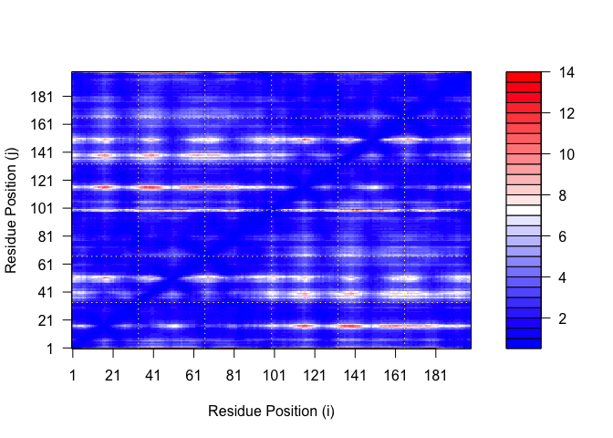

``` r
plot.dmat(pae5$pae, 
          xlab="Residue Position (i)",
          ylab="Residue Position (j)",
          grid.col = "black",
          zlim=c(0,30))
```


``` r
plot.dmat(pae1$pae, 
          xlab="Residue Position (i)",
          ylab="Residue Position (j)",
          grid.col = "black",
          zlim=c(0,30))
```


## Score Residue Conservation from alignment file

Alpha-fold returns it’s large alignment file used for analysis. Here we
read this rile and score conservation per position.

``` r
aln_file <- list.files(path=pth,
                       pattern=".a3m$",
                       full.names= TRUE)
aln_file
```

    [1] "dimer_23119_1//dimer_23119_1.a3m"

``` r
aln <- read.fasta(aln_file[1], to.upper = TRUE)
```

    [1] " ** Duplicated sequence id's: 101 **"
    [2] " ** Duplicated sequence id's: 101 **"

``` r
dim(aln$ali)
```

    [1] 5378  132

``` r
sim <- conserv(aln)

plotb3(sim[1:99],
       ylab="Conservation Score")
```


## Residue Conservation for Alignment File

``` r
aln_file <- list.files(path=results_dir,
                       pattern=".a3m$",
                        full.names = TRUE)
aln_file
```

    [1] "dimer_23119_1/dimer_23119_1.a3m"

``` r
aln <- read.fasta(aln_file[1], to.upper = TRUE)
```

    [1] " ** Duplicated sequence id's: 101 **"
    [2] " ** Duplicated sequence id's: 101 **"

``` r
dim(aln$ali)
```

    [1] 5378  132

``` r
sim <- conserv(aln)

plotb3(sim[1:99], sse=trim.pdb(pdb, chain="A"),
       ylab="Conservation Score")
```


``` r
con <- consensus(aln, cutoff = 0.9)
con$seq
```

      [1] "-" "-" "-" "-" "-" "-" "-" "-" "-" "-" "-" "-" "-" "-" "-" "-" "-" "-"
     [19] "-" "-" "-" "-" "-" "-" "D" "T" "G" "A" "-" "-" "-" "-" "-" "-" "-" "-"
     [37] "-" "-" "-" "-" "-" "-" "-" "-" "-" "-" "-" "-" "-" "-" "-" "-" "-" "-"
     [55] "-" "-" "-" "-" "-" "-" "-" "-" "-" "-" "-" "-" "-" "-" "-" "-" "-" "-"
     [73] "-" "-" "-" "-" "-" "-" "-" "-" "-" "-" "-" "-" "-" "-" "-" "-" "-" "-"
     [91] "-" "-" "-" "-" "-" "-" "-" "-" "-" "-" "-" "-" "-" "-" "-" "-" "-" "-"
    [109] "-" "-" "-" "-" "-" "-" "-" "-" "-" "-" "-" "-" "-" "-" "-" "-" "-" "-"
    [127] "-" "-" "-" "-" "-" "-"

``` r
m1.pdb <- read.pdb(pdb_files[1])
occ <- vec2resno(c(sim[1:99], sim[1:99]), m1.pdb$atom$resno)
write.pdb(m1.pdb, o=occ, file="m1_conserv.pdb")
```

## Find a gene project alpha fold continuation

``` r
library(bio3d)

pth <- "novel_d48c6"
pdb.file <- list.files(path=pth, full.names=TRUE, pattern= ".pdb")
```

``` r
file.exists(pdb.file)
```

    [1] TRUE TRUE TRUE TRUE TRUE

``` r
pdbs <- pdbaln(pdb.file, fit=TRUE, exefile="msa")
```

    Reading PDB files:
    novel_d48c6/novel_d48c6_unrelaxed_rank_001_alphafold2_ptm_model_5_seed_000.pdb
    novel_d48c6/novel_d48c6_unrelaxed_rank_002_alphafold2_ptm_model_2_seed_000.pdb
    novel_d48c6/novel_d48c6_unrelaxed_rank_003_alphafold2_ptm_model_1_seed_000.pdb
    novel_d48c6/novel_d48c6_unrelaxed_rank_004_alphafold2_ptm_model_3_seed_000.pdb
    novel_d48c6/novel_d48c6_unrelaxed_rank_005_alphafold2_ptm_model_4_seed_000.pdb
    .....

    Extracting sequences

    pdb/seq: 1   name: novel_d48c6/novel_d48c6_unrelaxed_rank_001_alphafold2_ptm_model_5_seed_000.pdb 
    pdb/seq: 2   name: novel_d48c6/novel_d48c6_unrelaxed_rank_002_alphafold2_ptm_model_2_seed_000.pdb 
    pdb/seq: 3   name: novel_d48c6/novel_d48c6_unrelaxed_rank_003_alphafold2_ptm_model_1_seed_000.pdb 
    pdb/seq: 4   name: novel_d48c6/novel_d48c6_unrelaxed_rank_004_alphafold2_ptm_model_3_seed_000.pdb 
    pdb/seq: 5   name: novel_d48c6/novel_d48c6_unrelaxed_rank_005_alphafold2_ptm_model_4_seed_000.pdb 

``` r
library(bio3dview)
view.pdbs(pdbs)
```

    file:////private/var/folders/m8/ndytkmz55395lwskyz8gkrsh0000gn/T/RtmppZNKw3/file1297532afa467/widget1297529528030.html screenshot completed

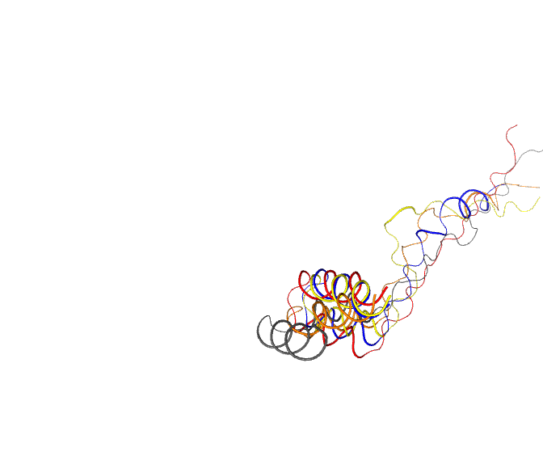

``` r
plot(pdbs$b[1,], typ="l", ylim=c(0,100))
lines(pdbs$b[5,], typ="l", col="red")
lines(pdbs$b[3,], typ="l", col="green")
```

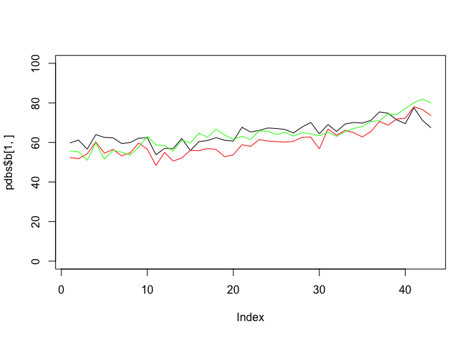

``` r
core <- core.find(pdbs)
```

     core size 42 of 43  vol = 1205.189 
     core size 41 of 43  vol = 1041.769 
     core size 40 of 43  vol = 868 
     core size 39 of 43  vol = 784.033 
     core size 38 of 43  vol = 684.46 
     core size 37 of 43  vol = 514.588 
     core size 36 of 43  vol = 327.276 
     core size 35 of 43  vol = 285.479 
     core size 34 of 43  vol = 245.102 
     core size 33 of 43  vol = 183.967 
     core size 32 of 43  vol = 137.695 
     core size 31 of 43  vol = 99.102 
     core size 30 of 43  vol = 74.297 
     core size 29 of 43  vol = 64.473 
     core size 28 of 43  vol = 51.949 
     core size 27 of 43  vol = 28.907 
     core size 26 of 43  vol = 15.468 
     core size 25 of 43  vol = 11.956 
     core size 24 of 43  vol = 10.347 
     core size 23 of 43  vol = 7.155 
     core size 22 of 43  vol = 4.509 
     core size 21 of 43  vol = 2.792 
     core size 20 of 43  vol = 2.391 
     core size 19 of 43  vol = 1.709 
     core size 18 of 43  vol = 1.197 
     core size 17 of 43  vol = 0.912 
     core size 16 of 43  vol = 0.774 
     core size 15 of 43  vol = 0.638 

## Custom Analysis of Resulting Models: Find a Gene Project

``` r
results_dir <- "novel_d48c6"
```

``` r
pdb_files <- list.files(path=results_dir,
                        pattern="*.pdb",
                        full.names = TRUE)
basename(pdb_files)
```

    [1] "novel_d48c6_unrelaxed_rank_001_alphafold2_ptm_model_5_seed_000.pdb"
    [2] "novel_d48c6_unrelaxed_rank_002_alphafold2_ptm_model_2_seed_000.pdb"
    [3] "novel_d48c6_unrelaxed_rank_003_alphafold2_ptm_model_1_seed_000.pdb"
    [4] "novel_d48c6_unrelaxed_rank_004_alphafold2_ptm_model_3_seed_000.pdb"
    [5] "novel_d48c6_unrelaxed_rank_005_alphafold2_ptm_model_4_seed_000.pdb"

``` r
library(bio3d)
pdbs <- pdbaln(pdb_files, fit=TRUE, exefile="msa")
```

    Reading PDB files:
    novel_d48c6/novel_d48c6_unrelaxed_rank_001_alphafold2_ptm_model_5_seed_000.pdb
    novel_d48c6/novel_d48c6_unrelaxed_rank_002_alphafold2_ptm_model_2_seed_000.pdb
    novel_d48c6/novel_d48c6_unrelaxed_rank_003_alphafold2_ptm_model_1_seed_000.pdb
    novel_d48c6/novel_d48c6_unrelaxed_rank_004_alphafold2_ptm_model_3_seed_000.pdb
    novel_d48c6/novel_d48c6_unrelaxed_rank_005_alphafold2_ptm_model_4_seed_000.pdb
    .....

    Extracting sequences

    pdb/seq: 1   name: novel_d48c6/novel_d48c6_unrelaxed_rank_001_alphafold2_ptm_model_5_seed_000.pdb 
    pdb/seq: 2   name: novel_d48c6/novel_d48c6_unrelaxed_rank_002_alphafold2_ptm_model_2_seed_000.pdb 
    pdb/seq: 3   name: novel_d48c6/novel_d48c6_unrelaxed_rank_003_alphafold2_ptm_model_1_seed_000.pdb 
    pdb/seq: 4   name: novel_d48c6/novel_d48c6_unrelaxed_rank_004_alphafold2_ptm_model_3_seed_000.pdb 
    pdb/seq: 5   name: novel_d48c6/novel_d48c6_unrelaxed_rank_005_alphafold2_ptm_model_4_seed_000.pdb 

``` r
pdbs
```

                                   1        .         .         .         .  43 
    [Truncated_Name:1]novel_d48c   MLPRLVSNSWPQVTLPPQPPKVLGLQARAMVPGHTYTLINILS
    [Truncated_Name:2]novel_d48c   MLPRLVSNSWPQVTLPPQPPKVLGLQARAMVPGHTYTLINILS
    [Truncated_Name:3]novel_d48c   MLPRLVSNSWPQVTLPPQPPKVLGLQARAMVPGHTYTLINILS
    [Truncated_Name:4]novel_d48c   MLPRLVSNSWPQVTLPPQPPKVLGLQARAMVPGHTYTLINILS
    [Truncated_Name:5]novel_d48c   MLPRLVSNSWPQVTLPPQPPKVLGLQARAMVPGHTYTLINILS
                                   ******************************************* 
                                   1        .         .         .         .  43 

    Call:
      pdbaln(files = pdb_files, fit = TRUE, exefile = "msa")

    Class:
      pdbs, fasta

    Alignment dimensions:
      5 sequence rows; 43 position columns (43 non-gap, 0 gap) 

    + attr: xyz, resno, b, chain, id, ali, resid, sse, call

``` r
rd <- rmsd(pdbs, fit=T)
```

    Warning in rmsd(pdbs, fit = T): No indices provided, using the 43 non NA positions

``` r
range(rd)
```

    [1] 0.000 9.803

``` r
library(pheatmap)

colnames(rd) <- paste0("m",1:5)
rownames(rd) <- paste0("m",1:5)
pheatmap(rd)
```

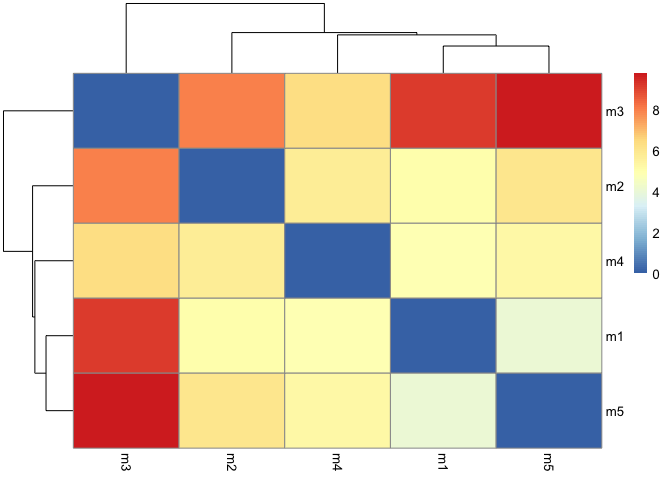

``` r
pdb <- read.pdb("1hsg")
```

      Note: Accessing on-line PDB file

    Warning in get.pdb(file, path = tempdir(), verbose = FALSE):
    /var/folders/m8/ndytkmz55395lwskyz8gkrsh0000gn/T//RtmppZNKw3/1hsg.pdb exists.
    Skipping download

``` r
plotb3(pdbs$b[1,], typ="l", lwd=2, sse=pdb)
```

    Warning in plotb3(pdbs$b[1, ], typ = "l", lwd = 2, sse = pdb): Length of input
    'sse' does not equal the length of input 'x'; Ignoring 'sse'

``` r
points(pdbs$b[2,], typ="l", col="red")
points(pdbs$b[3,], typ="l", col="blue")
points(pdbs$b[4,], typ="l", col="darkgreen")
points(pdbs$b[5,], typ="l", col="orange")
abline(v=100, col="gray")
```

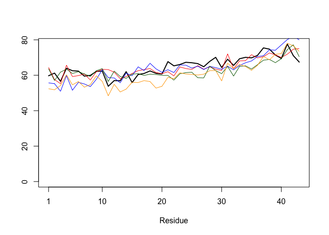

``` r
core.inds <- core.find(pdbs, thresh = 0.9)
```

     core size 42 of 43  vol = 1205.189 
     core size 41 of 43  vol = 1041.769 
     core size 40 of 43  vol = 868 
     core size 39 of 43  vol = 784.033 
     core size 38 of 43  vol = 684.46 
     core size 37 of 43  vol = 514.588 
     core size 36 of 43  vol = 327.276 
     core size 35 of 43  vol = 285.479 
     core size 34 of 43  vol = 245.102 
     core size 33 of 43  vol = 183.967 
     core size 32 of 43  vol = 137.695 
     core size 31 of 43  vol = 99.102 
     core size 30 of 43  vol = 74.297 
     core size 29 of 43  vol = 64.473 
     core size 28 of 43  vol = 51.949 
     core size 27 of 43  vol = 28.907 
     core size 26 of 43  vol = 15.468 
     core size 25 of 43  vol = 11.956 
     core size 24 of 43  vol = 10.347 
     core size 23 of 43  vol = 7.155 
     core size 22 of 43  vol = 4.509 
     core size 21 of 43  vol = 2.792 
     core size 20 of 43  vol = 2.391 
     core size 19 of 43  vol = 1.709 
     core size 18 of 43  vol = 1.197 
     core size 17 of 43  vol = 0.912 
     core size 16 of 43  vol = 0.774 
     core size 15 of 43  vol = 0.638 

``` r
xyz <- pdbfit(pdbs, core.inds, outpath = "corefit_structures")
```

``` r
rf <- rmsf(xyz)

plotb3(rf, sse=pdb)
```

    Warning in plotb3(rf, sse = pdb): Length of input 'sse' does not equal the
    length of input 'x'; Ignoring 'sse'

``` r
abline(v=100, col="gray", ylab="RMSF")
```

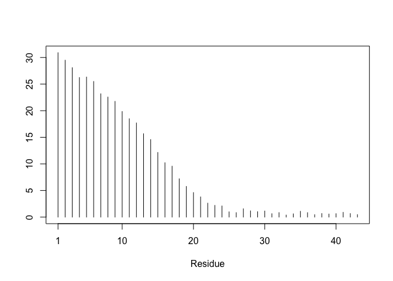

``` r
library(jsonlite)
pae_files <- list.files(path=results_dir,
                        pattern=".*model.*\\.json",
                        full.names = TRUE)
```

``` r
pae1 <- read_json(pae_files[1],simplifyVector = TRUE)
pae5 <- read_json(pae_files[5],simplifyVector = TRUE)

attributes(pae1)
```

    $names
    [1] "plddt"   "max_pae" "pae"     "ptm"    

``` r
head(pae1$plddt) 
```

    [1] 59.72 61.22 56.59 63.97 62.56 62.34

``` r
pae1$max_pae
```

    [1] 30.09375

``` r
pae5$max_pae
```

    [1] 29.92188

``` r
plot.dmat(pae1$pae, 
          xlab="Residue Position (i)",
          ylab="Residue Position (j)")
```

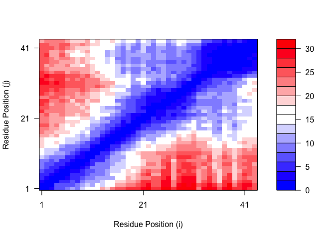

``` r
plot.dmat(pae5$pae, 
          xlab="Residue Position (i)",
          ylab="Residue Position (j)",
          grid.col = "black",
          zlim=c(0,30))
```

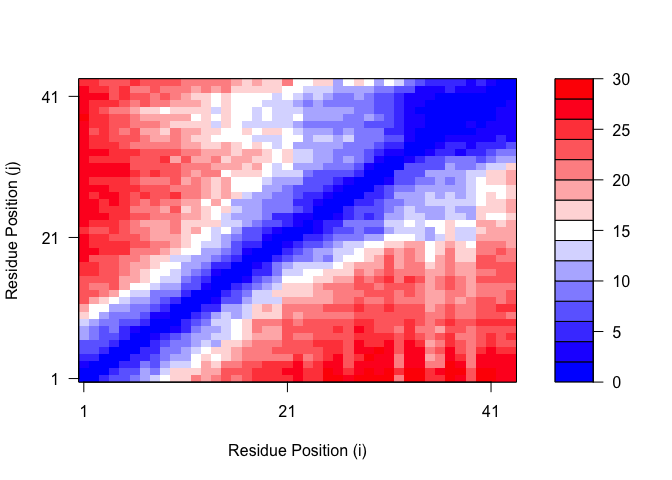

``` r
plot.dmat(pae1$pae, 
          xlab="Residue Position (i)",
          ylab="Residue Position (j)",
          grid.col = "black",
          zlim=c(0,30))
```

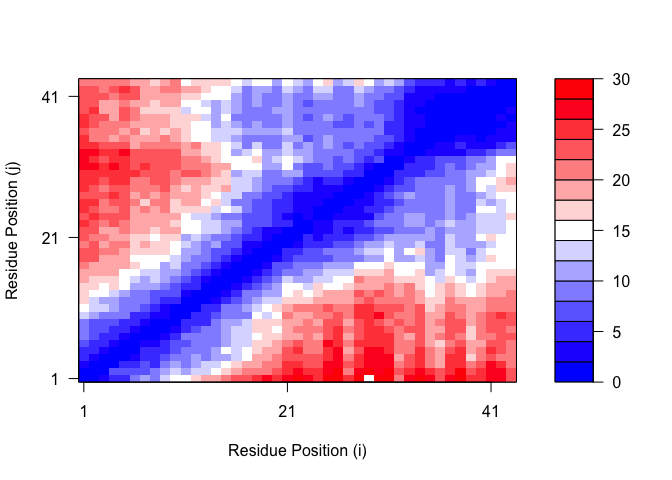

``` r
aln_file <- list.files(path=results_dir,
                       pattern=".a3m$",
                        full.names = TRUE)
aln_file
```

    [1] "novel_d48c6/novel_d48c6.a3m"

``` r
aln <- read.fasta(aln_file[1], to.upper = TRUE)
```

    [1] " ** Duplicated sequence id's: 101 **"

``` r
dim(aln$ali)
```

    [1] 6234   75

``` r
sim <- conserv(aln)

plotb3(sim[1:99], sse=trim.pdb(pdb, chain="A"),
       ylab="Conservation Score")
```

    Warning in tmp.sse[!is.na(x)] <- sse: number of items to replace is not a
    multiple of replacement length

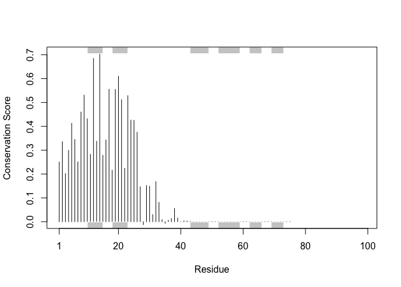

``` r
con <- consensus(aln, cutoff = 0.7)
con$seq
```

     [1] "-" "-" "-" "-" "-" "-" "-" "-" "S" "-" "-" "Q" "-" "I" "-" "-" "P" "-" "P"
    [20] "P" "-" "-" "L" "-" "-" "-" "-" "-" "-" "-" "-" "-" "-" "-" "-" "-" "-" "-"
    [39] "-" "-" "-" "-" "-" "-" "-" "-" "-" "-" "-" "-" "-" "-" "-" "-" "-" "-" "-"
    [58] "-" "-" "-" "-" "-" "-" "-" "-" "-" "-" "-" "-" "-" "-" "-" "-" "-" "-"

``` r
library(bio3d)
```
