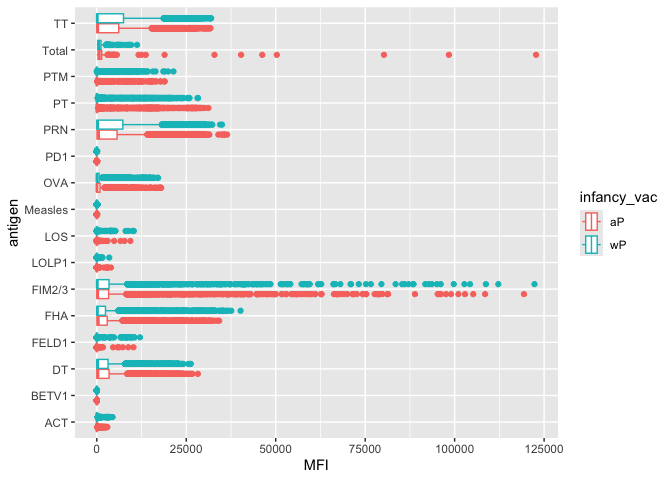

# Class 18: Pertussis mini project
Christopher Levinger (A17390693)

## Background

Perussis (also known as whooping cough) is a common lung infection
caused by the bacteria *B. Pertussis*.

The CDC tracks cases of Pertussis in the US:
https://www.cdc.gov/pertussis/php/surveillance/pertussis-cases-by-year.html
https://tinyurl.com/pertussiscdc

## Examining cases of Pertussis by year

We can use the **datapasta** package to scrape case numbers from teh CDC
website.

> Q1. Make a plot of pertussis cases per year using ggplot

``` r
library(ggplot2)
cases <- ggplot(cdc,aes(x=Year,y=cases)) +
  geom_point() +
  geom_line()

cases
```


> Q2. Add some key time points in our history of interaection with
> Pertussis to our plot. These include the rollout of the WP first
> vaccine in 1946 and the switch to aP in 1996.

We can use `geom_vline()` with an x-intercept argument.

``` r
cases +
  geom_vline(xintercept=1946, col="blue") +
  geom_vline(xintercept=1996, col="red") +
  geom_vline(xintercept=2020,col="purple")
```


> Q3. Describe what happened after the introduction of the aP vaccine?
> Do you have a possible explanation for the observed trend?

The wp vaccine seems to have signficantly dropped cases starting in 1946
leading to a large drop and almost flatline slightly before 1975. From
the second vaccine rollout, of the ap in 1996 we see a similar flatline
immediately after the rollout but then an increase in cases decades or
so after this vaccine rollout. Then during COVID in 2020, with lockdowns
we were able to surpress the number of cases of whooping cough
respiratory infection leading to a trough during this period. The
interesting point is that after the introduction of the ap vaccine, we
saw across multiple countries, a consistent delay before a sudden
resurgence of cases, which suggest that the ap vaccine may be less
effective than the just the previous wp vaccine.

Mounting evidence suggests that the newer **aP** vaccine is less
effective over the long term than the older **wP** vaccine that it
replaced. In other words, vaccine protection wanes more rapidly with aP
than with wP.

## Enter the CMI-PB project

CMI-PB (Computational Models of Immunity - Pertussis boost) major goal
is to investigate how the immune system responds differently to aP
vs. wP vaccinated individuals and be able to predict this at an early
stage.

CMI-PB makes all their collected data freely available and they store it
in a database composed of different tables. Here we will access a few of
these.

We can use the **jsonlite** package to read this data.

``` r
library(jsonlite)

subject <- read_json("https://www.cmi-pb.org/api/v5_1/subject", simplifyVector=TRUE)

head(subject)
```

      subject_id infancy_vac biological_sex              ethnicity  race
    1          1          wP         Female Not Hispanic or Latino White
    2          2          wP         Female Not Hispanic or Latino White
    3          3          wP         Female                Unknown White
    4          4          wP           Male Not Hispanic or Latino Asian
    5          5          wP           Male Not Hispanic or Latino Asian
    6          6          wP         Female Not Hispanic or Latino White
      year_of_birth date_of_boost      dataset
    1    1986-01-01    2016-09-12 2020_dataset
    2    1968-01-01    2019-01-28 2020_dataset
    3    1983-01-01    2016-10-10 2020_dataset
    4    1988-01-01    2016-08-29 2020_dataset
    5    1991-01-01    2016-08-29 2020_dataset
    6    1988-01-01    2016-10-10 2020_dataset

> Q. How many subjects are there in this dataset?

``` r
nrow(subject)
```

    [1] 172

> Q4. How many “aP” and “wP” individuals/subjects are there? There are
> 87 aP and 85 wP.

``` r
table(subject$infancy_vac)
```


    aP wP 
    87 85 

> Q5. How many Male/Female are in the dataset? 112 females and 60 males.

``` r
table(subject$biological_sex)
```


    Female   Male 
       112     60 

> Q6. How abour gender and race breakdown?

``` r
table(subject$race, subject$biological_sex)
```

                                               
                                                Female Male
      American Indian/Alaska Native                  0    1
      Asian                                         32   12
      Black or African American                      2    3
      More Than One Race                            15    4
      Native Hawaiian or Other Pacific Islander      1    1
      Unknown or Not Reported                       14    7
      White                                         48   32

> Q. Is this representative of the U.S. demographics? This data is not
> representative U.S. demographic and is from a biased sample of UCSD
> students.

``` r
library(lubridate)
```


    Attaching package: 'lubridate'

    The following objects are masked from 'package:base':

        date, intersect, setdiff, union

``` r
today()
```

    [1] "2025-06-08"

``` r
today() - ymd("2000-01-01")
```

    Time difference of 9290 days

``` r
time_length( today() - ymd("2000-01-01"),  "years")
```

    [1] 25.43463

> Q7. Using this approach determine (i) the average age of wP
> individuals, (ii) the average age of aP individuals; and (iii) are
> they significantly different?

Keep in mind that some of these values will differ from the lab sheet
because the today function is different than what is in the lab sheet
because I am writing this report at a later point in time.

``` r
subject$age <- today() - ymd(subject$year_of_birth)
```

``` r
library(dplyr)
```


    Attaching package: 'dplyr'

    The following objects are masked from 'package:stats':

        filter, lag

    The following objects are masked from 'package:base':

        intersect, setdiff, setequal, union

``` r
ap <- subject %>% filter(infancy_vac == "aP")

round( summary( time_length( ap$age, "years" ) ) )
```

       Min. 1st Qu.  Median    Mean 3rd Qu.    Max. 
         22      26      27      27      28      34 

``` r
wp <- subject %>% filter(infancy_vac == "wP")
round( summary( time_length( wp$age, "years" ) ) )
```

       Min. 1st Qu.  Median    Mean 3rd Qu.    Max. 
         22      32      34      36      39      57 

Therefore, to answer Question 7, the average age of wp individuals
appears to be 36, while the average age of ap appears to be 27, leading
to a difference of 9. Thus, there seems to be a noticeable difference in
the average age between these samples, although it is up to
interpretation whether 9 years could be classified as significant.
However, it does appear through the descriptive statistics above for our
samples, that apart from the minimum, the data for wp does appear
significantly shifted up, which makes sense given our mean is higher.

> Q8. Determine the age of all individuals at time of boost? The age at
> boost function will ouput all of these ages with all of the results
> shown below.

``` r
int <- ymd(subject$date_of_boost) - ymd(subject$year_of_birth)
age_at_boost <- time_length(int, "year")
age_at_boost
```

      [1] 30.69678 51.07461 33.77413 28.65982 25.65914 28.77481 35.84942 34.14921
      [9] 20.56400 34.56263 30.65845 34.56263 19.56194 23.61944 27.61944 29.56331
     [17] 36.69815 19.65777 22.73511 35.65777 33.65914 31.65777 25.73580 24.70089
     [25] 28.70089 33.73580 19.73443 34.73511 19.73443 28.73648 27.73443 19.81109
     [33] 26.77344 33.81246 25.77413 19.81109 18.85010 19.81109 31.81109 22.81177
     [41] 31.84942 19.84942 18.85010 18.85010 19.90691 18.85010 20.90897 19.04449
     [49] 20.04381 19.90691 19.90691 19.00616 19.00616 20.04381 20.04381 20.07940
     [57] 21.08145 20.07940 20.07940 20.07940 32.26557 25.90007 23.90144 25.90007
     [65] 28.91992 42.92129 47.07461 47.07461 29.07324 21.07324 21.07324 28.15058
     [73] 24.15058 24.15058 21.14990 21.14990 31.20876 26.20671 32.20808 27.20876
     [81] 26.20671 21.20739 20.26557 22.26420 19.32375 21.32238 19.32375 19.32375
     [89] 22.41752 20.41889 21.41821 19.47707 23.47707 20.47639 21.47570 19.47707
     [97] 35.90965 28.73648 22.68309 20.83231 18.83368 18.83368 27.68241 32.68172
    [105] 27.68241 25.68378 23.68241 26.73785 32.73648 24.73648 25.79603 25.79603
    [113] 25.79603 31.79466 19.83299 21.91102 27.90965 24.06297 23.90965 27.12115
    [121] 22.12183 23.12115 26.17933 22.17933 29.17728 29.23477 26.23682 28.29295
    [129] 31.29363 26.29432 24.35044 27.35113 25.40999 32.41068 27.56194 27.41136
    [137] 24.50650 22.56263 29.56057 21.69473 26.69678 31.90691 19.90691 23.90691
    [145] 20.90623 31.00616 23.00616 35.00616 32.00548 32.00548 31.04449 28.12047
    [153] 25.11978 26.11910 26.19302 22.19302 26.19302 23.19507 29.19370 27.32923
    [161] 30.32717 24.55852 30.55715 32.55852 30.55715 22.67488 26.67488 32.67625
    [169] 20.67625 31.75086 20.86516 36.06297

> Q9. With the help of a faceted boxplot or histogram (see below), do
> you think these two groups are significantly different? It is evident
> that these two groups are statistically with the blue group showing a
> clear shift to the right compared to the red group and also appears
> much more uniformly distributed across such shift compared to the red
> group. This difference was further confirmed with the computing of a
> pvalue of 2.372101e-23, which is way below the significance threshold
> of 0.05, and thus we can clearly state a statiscally significant
> difference between the wp and ap groups, where the wp appears much
> more shifted towards higher ages consistent with the descriptive
> statistics above.

``` r
ggplot(subject) +
  aes(time_length(age, "year"),
      fill=as.factor(infancy_vac)) +
  geom_histogram(show.legend=FALSE) +
  facet_wrap(vars(infancy_vac), nrow=2) +
  xlab("Age in years")
```

    `stat_bin()` using `bins = 30`. Pick better value with `binwidth`.


``` r
x <- t.test(time_length( wp$age, "years" ),
       time_length( ap$age, "years" ))

x$p.value
```

    [1] 2.372101e-23

Let’s read another database table from CMIpb

``` r
specimen <- read_json("https://www.cmi-pb.org/api/v5_1/specimen", simplifyVector=TRUE)
ab_data <- read_json("https://www.cmi-pb.org/api/v5_1/plasma_ab_titer", simplifyVector=TRUE)
```

Let’s take at these data

``` r
head(specimen)
```

      specimen_id subject_id actual_day_relative_to_boost
    1           1          1                           -3
    2           2          1                            1
    3           3          1                            3
    4           4          1                            7
    5           5          1                           11
    6           6          1                           32
      planned_day_relative_to_boost specimen_type visit
    1                             0         Blood     1
    2                             1         Blood     2
    3                             3         Blood     3
    4                             7         Blood     4
    5                            14         Blood     5
    6                            30         Blood     6

``` r
head(ab_data)
```

      specimen_id isotype is_antigen_specific antigen        MFI MFI_normalised
    1           1     IgE               FALSE   Total 1110.21154       2.493425
    2           1     IgE               FALSE   Total 2708.91616       2.493425
    3           1     IgG                TRUE      PT   68.56614       3.736992
    4           1     IgG                TRUE     PRN  332.12718       2.602350
    5           1     IgG                TRUE     FHA 1887.12263      34.050956
    6           1     IgE                TRUE     ACT    0.10000       1.000000
       unit lower_limit_of_detection
    1 UG/ML                 2.096133
    2 IU/ML                29.170000
    3 IU/ML                 0.530000
    4 IU/ML                 6.205949
    5 IU/ML                 4.679535
    6 IU/ML                 2.816431

> Q9. Complete the code to join specimen and subject tables to make a
> new merged data frame containing all specimen records along with their
> associated subject details:

We want to join these thables to get all our information together. For
this, we will use the dplyr package and the inner_join function.

``` r
library(dplyr)

meta <- inner_join(subject, specimen)
```

    Joining with `by = join_by(subject_id)`

``` r
head(meta)
```

      subject_id infancy_vac biological_sex              ethnicity  race
    1          1          wP         Female Not Hispanic or Latino White
    2          1          wP         Female Not Hispanic or Latino White
    3          1          wP         Female Not Hispanic or Latino White
    4          1          wP         Female Not Hispanic or Latino White
    5          1          wP         Female Not Hispanic or Latino White
    6          1          wP         Female Not Hispanic or Latino White
      year_of_birth date_of_boost      dataset        age specimen_id
    1    1986-01-01    2016-09-12 2020_dataset 14403 days           1
    2    1986-01-01    2016-09-12 2020_dataset 14403 days           2
    3    1986-01-01    2016-09-12 2020_dataset 14403 days           3
    4    1986-01-01    2016-09-12 2020_dataset 14403 days           4
    5    1986-01-01    2016-09-12 2020_dataset 14403 days           5
    6    1986-01-01    2016-09-12 2020_dataset 14403 days           6
      actual_day_relative_to_boost planned_day_relative_to_boost specimen_type
    1                           -3                             0         Blood
    2                            1                             1         Blood
    3                            3                             3         Blood
    4                            7                             7         Blood
    5                           11                            14         Blood
    6                           32                            30         Blood
      visit
    1     1
    2     2
    3     3
    4     4
    5     5
    6     6

``` r
dim(meta)
```

    [1] 1503   14

> Q10. Now using the same procedure join meta with titer data so we can
> further analyze this data in terms of time of visit aP/wP, male/female
> etc.

One more “join” to get ab_data and meta all together

``` r
abdata <- inner_join(ab_data, meta)
```

    Joining with `by = join_by(specimen_id)`

``` r
head(abdata)
```

      specimen_id isotype is_antigen_specific antigen        MFI MFI_normalised
    1           1     IgE               FALSE   Total 1110.21154       2.493425
    2           1     IgE               FALSE   Total 2708.91616       2.493425
    3           1     IgG                TRUE      PT   68.56614       3.736992
    4           1     IgG                TRUE     PRN  332.12718       2.602350
    5           1     IgG                TRUE     FHA 1887.12263      34.050956
    6           1     IgE                TRUE     ACT    0.10000       1.000000
       unit lower_limit_of_detection subject_id infancy_vac biological_sex
    1 UG/ML                 2.096133          1          wP         Female
    2 IU/ML                29.170000          1          wP         Female
    3 IU/ML                 0.530000          1          wP         Female
    4 IU/ML                 6.205949          1          wP         Female
    5 IU/ML                 4.679535          1          wP         Female
    6 IU/ML                 2.816431          1          wP         Female
                   ethnicity  race year_of_birth date_of_boost      dataset
    1 Not Hispanic or Latino White    1986-01-01    2016-09-12 2020_dataset
    2 Not Hispanic or Latino White    1986-01-01    2016-09-12 2020_dataset
    3 Not Hispanic or Latino White    1986-01-01    2016-09-12 2020_dataset
    4 Not Hispanic or Latino White    1986-01-01    2016-09-12 2020_dataset
    5 Not Hispanic or Latino White    1986-01-01    2016-09-12 2020_dataset
    6 Not Hispanic or Latino White    1986-01-01    2016-09-12 2020_dataset
             age actual_day_relative_to_boost planned_day_relative_to_boost
    1 14403 days                           -3                             0
    2 14403 days                           -3                             0
    3 14403 days                           -3                             0
    4 14403 days                           -3                             0
    5 14403 days                           -3                             0
    6 14403 days                           -3                             0
      specimen_type visit
    1         Blood     1
    2         Blood     1
    3         Blood     1
    4         Blood     1
    5         Blood     1
    6         Blood     1

``` r
dim(abdata)
```

    [1] 61956    21

> Q11. How many Ab isotypes are there in the dataset? There are 6
> different isotypes.

> Q. How many different antigens are measured in the dataset? There are
> 16 different antigens in the dataset.

``` r
a <- table(abdata$isotype)
nrow(a)
```

    [1] 6

``` r
b <- table(abdata$antigen)
nrow(b)
```

    [1] 16

> Q12. What are the different \$dataset values in abdata and what do you
> notice about the number of rows for the most “recent” dataset? The
> different \$dataset values seem to start off very high around 2020 and
> then drop off considerably into 2021 and slighly fall more in 2022
> before climibing back up again in the 2023 dataset. Specific values
> are seen in the code chunk below. The number of rows for the most
> recent dataset in 2023 seems to have increased over two fold from the
> last year of 2022.

``` r
table(abdata$dataset)
```


    2020_dataset 2021_dataset 2022_dataset 2023_dataset 
           31520         8085         7301        15050 

> Q. Make a boxplot of antigen levels across the whole dataset? (MFI vs
> antigen)

``` r
library(ggplot2)
ggplot(abdata,aes(x=MFI, y=antigen)) +
  geom_boxplot()
```

    Warning: Removed 1 row containing non-finite outside the scale range
    (`stat_boxplot()`).


> Q. Are there obvious differences between aP and wP values? Looking at
> the boxplot below, it is hard to see obvious differences between the
> two and it seems very similar.

``` r
ggplot(abdata) +
  aes(MFI, antigen, col=infancy_vac) +
  geom_boxplot()
```

    Warning: Removed 1 row containing non-finite outside the scale range
    (`stat_boxplot()`).



## Focus on IgG levels

IgG is the most abundant antibody in blood. Wit four sub-classes (IgG1
to IgG4) crucial for long-term immunity and resonding to bacterial &
viral infections.

``` r
igg <- 
  abdata |> filter(isotype == "IgG")
head(igg)
```

      specimen_id isotype is_antigen_specific antigen        MFI MFI_normalised
    1           1     IgG                TRUE      PT   68.56614       3.736992
    2           1     IgG                TRUE     PRN  332.12718       2.602350
    3           1     IgG                TRUE     FHA 1887.12263      34.050956
    4          19     IgG                TRUE      PT   20.11607       1.096366
    5          19     IgG                TRUE     PRN  976.67419       7.652635
    6          19     IgG                TRUE     FHA   60.76626       1.096457
       unit lower_limit_of_detection subject_id infancy_vac biological_sex
    1 IU/ML                 0.530000          1          wP         Female
    2 IU/ML                 6.205949          1          wP         Female
    3 IU/ML                 4.679535          1          wP         Female
    4 IU/ML                 0.530000          3          wP         Female
    5 IU/ML                 6.205949          3          wP         Female
    6 IU/ML                 4.679535          3          wP         Female
                   ethnicity  race year_of_birth date_of_boost      dataset
    1 Not Hispanic or Latino White    1986-01-01    2016-09-12 2020_dataset
    2 Not Hispanic or Latino White    1986-01-01    2016-09-12 2020_dataset
    3 Not Hispanic or Latino White    1986-01-01    2016-09-12 2020_dataset
    4                Unknown White    1983-01-01    2016-10-10 2020_dataset
    5                Unknown White    1983-01-01    2016-10-10 2020_dataset
    6                Unknown White    1983-01-01    2016-10-10 2020_dataset
             age actual_day_relative_to_boost planned_day_relative_to_boost
    1 14403 days                           -3                             0
    2 14403 days                           -3                             0
    3 14403 days                           -3                             0
    4 15499 days                           -3                             0
    5 15499 days                           -3                             0
    6 15499 days                           -3                             0
      specimen_type visit
    1         Blood     1
    2         Blood     1
    3         Blood     1
    4         Blood     1
    5         Blood     1
    6         Blood     1

> Q13. Complete the following code to make a summary boxplot of Ab titer
> levels (MFI) for all antigens: Same boxplot of antigens as before

``` r
ggplot(igg) +
  aes(MFI_normalised, antigen, col=infancy_vac) +
  geom_boxplot() +
  facet_wrap(~visit)
```


``` r
ggplot(igg) +
  aes(MFI_normalised, antigen) +
  geom_boxplot() + 
    xlim(0,75) +
  facet_wrap(vars(visit), nrow=2)
```

    Warning: Removed 5 rows containing non-finite outside the scale range
    (`stat_boxplot()`).


> Q14. What antigens show differences in the level of IgG antibody
> titers recognizing them over time? Why these and not others? (The main
> summary of my conclusions is in the last few sentences). While this
> question involves much interpretation and many of the antigens are
> skewed by high MFI normalized values, I can attempt to give a general
> interpetation of the antibody titers to see their effectivity in
> recogninzing these samples post-dosage in both the wp and ap samples
> using the website that we were told to use for this question. One of
> the biggest shifts in higher titer levels is most notably seen in the
> graphs above for FIM2/3, where we do a see a steady increaase in the
> median MFI normalized, showing we are seeing some fluorescence from
> antibody recongnition of this antigen upon this specific vaccine. This
> is reflected in the cmi-pb website, where see a larger increase upon
> days after dosage of the ab titer for the ap samples compared to a
> small and less steady increase the ab titer for the wp samples. The TT
> sample levels seem pretty constant looking at the boxplot across time,
> but there seem to be more heavy outliers with increased days past
> dosage that may be skewing the data a little more over time, seeing
> from the cmi-pb website, but we do not see that similar trend as for
> the FIM2/3. Looking at the PT samples, we do see a somewhat increase
> in the median of the boxplot overtime, obviously not as much as
> FIM2/3, and this is also reflected a slighthly higher linear slope for
> ap rather than wp in the cmi-pb chart. Like PT, there does not seem to
> be a very notable shift in increased ab titer for the PRN, seen with
> the MFI-normalized which shows mean fluorescence intensity, which
> should be greater upon more antibody binding. PRN only shows a slight
> increase in ab titer like PT, which is also reflected in the cmi-pb
> website, with smaller increases less than the extent of FIM2/3. the
> OVA antigen has even less of a shift in increases MFI over time, and
> in fact appears constant for the graph of time vs. ab titer in the
> cmi-pb website. There appears to be no really recongizable changes in
> the titer of antibody binding for OVA increasing, probably the least
> we have seen so far. Fim 2/3 lowercase in this case shows a simlar
> trend to the OVA antigen. The FHA data is a very confusing
> distribution because the median fluorescence intensity and is very low
> and is skewed by a very large number of outliers of high fluorescence,
> much more noticeably than for the other antigens. Thus, while we many
> be able to extrapolate increases in ab titer over time, there is no
> very significant shift that we can be confident on, given the very
> heavy skew in this data, unlike the FIM 2/3 data that shows not too
> much skew, especially in plots 5 through 7. Thus, it appears that
> maybe there could be some promise here, like the slight increases we
> saw for some of the other antigens above, but it is hard to be
> definitive. The antigen DT appears very constant as well over the time
> period and close to 0 fluoresence, showing likely little antibody
> recognition of this antigen. The reason for this conclusion likely has
> to do with both the design of the antibody and the bacterial targets,
> and specifically the antigens they most express. The vaccine was
> likely constructed, especially the ap vaccine, with many FIM 2/3
> antibodies to target this antigen in the bacteria, which is why we see
> that large increase, especially notable in plots 5 through 7, of
> fluorescence from consistent binding to these sites of the bacteria.
> We also saw small increases in fluoresnce for antigens like FHA and PT
> and PRN, which likely is do the concentration of these antibodies in
> the vaccine being lower than FIM 2/3 and thus we see less signal when
> they bind to the antigen targets of the whooping cough bacteria. The
> others that showed almost no noticeable increases, namely, TT, OVA,
> and DT in mean fluorescence identity were likely for two reasons being
> either the antibodies were not preseent in the vaccine to target these
> antigens on the bacteria, or these antigens are severly unexpressed in
> the bacteria and thus no signal was picked up.

Focus in further in just one of these antigens - let’s pick **PT**
(Pertussis Toxin, one of the main toxins of the bacteria) in the
**2021_dataset** for **IgG** antibody isotypes.

``` r
table(igg$dataset)
```


    2020_dataset 2021_dataset 2022_dataset 2023_dataset 
            1182         1617         1456         3010 

``` r
pt_igg <- abdata |>
  filter(isotype=="IgG", 
         antigen=="PT", 
         dataset=="2021_dataset")
```

``` r
head(pt_igg)
```

      specimen_id isotype is_antigen_specific antigen    MFI MFI_normalised unit
    1         468     IgG               FALSE      PT 112.75      1.0000000  MFI
    2         469     IgG               FALSE      PT 111.25      0.9866962  MFI
    3         470     IgG               FALSE      PT 125.50      1.1130820  MFI
    4         471     IgG               FALSE      PT 224.25      1.9889135  MFI
    5         472     IgG               FALSE      PT 304.00      2.6962306  MFI
    6         473     IgG               FALSE      PT 274.00      2.4301552  MFI
      lower_limit_of_detection subject_id infancy_vac biological_sex
    1                 5.197441         61          wP         Female
    2                 5.197441         61          wP         Female
    3                 5.197441         61          wP         Female
    4                 5.197441         61          wP         Female
    5                 5.197441         61          wP         Female
    6                 5.197441         61          wP         Female
                   ethnicity                    race year_of_birth date_of_boost
    1 Not Hispanic or Latino Unknown or Not Reported    1987-01-01    2019-04-08
    2 Not Hispanic or Latino Unknown or Not Reported    1987-01-01    2019-04-08
    3 Not Hispanic or Latino Unknown or Not Reported    1987-01-01    2019-04-08
    4 Not Hispanic or Latino Unknown or Not Reported    1987-01-01    2019-04-08
    5 Not Hispanic or Latino Unknown or Not Reported    1987-01-01    2019-04-08
    6 Not Hispanic or Latino Unknown or Not Reported    1987-01-01    2019-04-08
           dataset        age actual_day_relative_to_boost
    1 2021_dataset 14038 days                           -4
    2 2021_dataset 14038 days                            1
    3 2021_dataset 14038 days                            3
    4 2021_dataset 14038 days                            7
    5 2021_dataset 14038 days                           14
    6 2021_dataset 14038 days                           30
      planned_day_relative_to_boost specimen_type visit
    1                             0         Blood     1
    2                             1         Blood     2
    3                             3         Blood     3
    4                             7         Blood     4
    5                            14         Blood     5
    6                            30         Blood     6

``` r
dim(pt_igg)
```

    [1] 231  21

``` r
ggplot(pt_igg) +
  aes(actual_day_relative_to_boost,
      MFI_normalised,
      col=infancy_vac,
      group=subject_id) +
  geom_point() +
  geom_line() +
  theme_bw() +
  geom_vline(xintercept=0) +
  geom_vline(xintercept=14)
```


