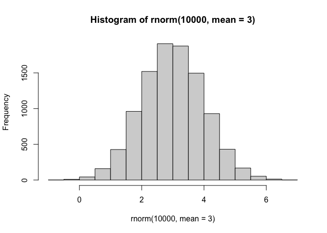
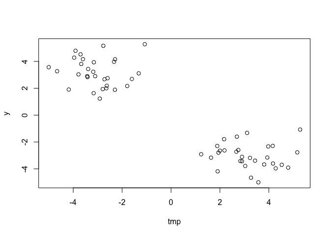
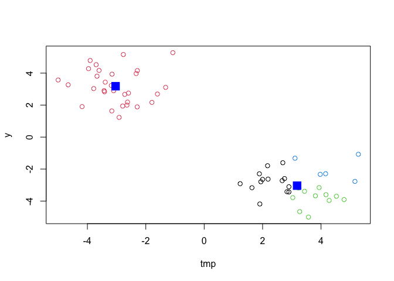

# Class 7: Machine Learning 1
Christopher Levinger (A17390693)

- [Clustering](#clustering)
  - [Hierarchal Clustering](#hierarchal-clustering)
- [Principal Component Analysis
  (PCA)](#principal-component-analysis-pca)
  - [Data input](#data-input)

## Clustering

Today we will explore unsupervised machine learning methods starting
with clustering and dimensionality reduction.

``` r
rnorm(10)
```

     [1] -0.00277812 -1.00514142 -0.01159533  1.41618577  1.31885775  0.92148577
     [7] -1.41434000 -0.98441071  0.41112732  0.39009039

Return 1000 numbers centered on 3 in histogram

``` r
hist(rnorm(10000, mean=3))
```



This histogram depicts a normally distributed set of data that is
centered on a mean, median, and mode of 3, where all data points are
symmetrically located around 3.

Return 30 numbers centered on -3

``` r
tmp <- c(rnorm(30, mean=-3),
  rnorm(30, mean=3))

x <- cbind(tmp, y=rev(tmp))

x
```

                tmp         y
     [1,] -3.413526  2.071208
     [2,] -3.745219  2.284698
     [3,] -2.917112  3.017303
     [4,] -1.068089  3.882849
     [5,] -3.128618  3.870495
     [6,] -2.073791  3.290488
     [7,] -1.692768  3.291027
     [8,] -2.499391  1.192530
     [9,] -2.162577  2.673489
    [10,] -4.259426  3.876333
    [11,] -2.347655  2.344388
    [12,] -3.857155  2.046238
    [13,] -2.667930  1.738773
    [14,] -3.562210  1.990327
    [15,] -3.991491  4.168163
    [16,] -2.889510  3.704121
    [17,] -3.468412  2.420892
    [18,] -1.440996  3.131627
    [19,] -1.887570  2.642798
    [20,] -2.634675  3.561069
    [21,] -3.584407  2.597936
    [22,] -2.109049  3.378568
    [23,] -2.102595  4.148099
    [24,] -4.611818  1.677148
    [25,] -3.409405  1.650606
    [26,] -4.152845  5.200558
    [27,] -1.230113  4.348933
    [28,] -2.432503  4.247820
    [29,] -3.519984  2.875997
    [30,] -3.142841  3.619951
    [31,]  3.619951 -3.142841
    [32,]  2.875997 -3.519984
    [33,]  4.247820 -2.432503
    [34,]  4.348933 -1.230113
    [35,]  5.200558 -4.152845
    [36,]  1.650606 -3.409405
    [37,]  1.677148 -4.611818
    [38,]  4.148099 -2.102595
    [39,]  3.378568 -2.109049
    [40,]  2.597936 -3.584407
    [41,]  3.561069 -2.634675
    [42,]  2.642798 -1.887570
    [43,]  3.131627 -1.440996
    [44,]  2.420892 -3.468412
    [45,]  3.704121 -2.889510
    [46,]  4.168163 -3.991491
    [47,]  1.990327 -3.562210
    [48,]  1.738773 -2.667930
    [49,]  2.046238 -3.857155
    [50,]  2.344388 -2.347655
    [51,]  3.876333 -4.259426
    [52,]  2.673489 -2.162577
    [53,]  1.192530 -2.499391
    [54,]  3.291027 -1.692768
    [55,]  3.290488 -2.073791
    [56,]  3.870495 -3.128618
    [57,]  3.882849 -1.068089
    [58,]  3.017303 -2.917112
    [59,]  2.284698 -3.745219
    [60,]  2.071208 -3.413526

Make a plot of `x`

``` r
plot(x)
```



This plot simply depicts the values x representing tmp, plotted against
y, which represents rev(tmp) or rev(x). Since the variable x consists of
a vector of 30 elements, the variable simply represents the same set of
values in vector form, except that the 30th element of vector x is the
1st element of vector y and so on. These values plotted against each
other can be seen in the figure above. Here, it appears as though
clusters begin to from, which will be helpful in our coming k means
analysis. \### K-means

The main function in “base” R for clustering is called `kmeans()`

``` r
km <- kmeans(x, centers=2)
km
```

    K-means clustering with 2 clusters of sizes 30, 30

    Cluster means:
            tmp         y
    1 -2.866789  3.031481
    2  3.031481 -2.866789

    Clustering vector:
     [1] 1 1 1 1 1 1 1 1 1 1 1 1 1 1 1 1 1 1 1 1 1 1 1 1 1 1 1 1 1 1 2 2 2 2 2 2 2 2
    [39] 2 2 2 2 2 2 2 2 2 2 2 2 2 2 2 2 2 2 2 2 2 2

    Within cluster sum of squares by cluster:
    [1] 53.04834 53.04834
     (between_SS / total_SS =  90.8 %)

    Available components:

    [1] "cluster"      "centers"      "totss"        "withinss"     "tot.withinss"
    [6] "betweenss"    "size"         "iter"         "ifault"      

The `kmeans()` function returns a “list” with 9 components. You can see
the named components of any list with the `attributes()` function.

``` r
attributes(km)
```

    $names
    [1] "cluster"      "centers"      "totss"        "withinss"     "tot.withinss"
    [6] "betweenss"    "size"         "iter"         "ifault"      

    $class
    [1] "kmeans"

> Q. How many points are in each cluster?

``` r
km$size
```

    [1] 30 30

> Q. Cluster assignment/membership vector?

``` r
km$cluster
```

     [1] 1 1 1 1 1 1 1 1 1 1 1 1 1 1 1 1 1 1 1 1 1 1 1 1 1 1 1 1 1 1 2 2 2 2 2 2 2 2
    [39] 2 2 2 2 2 2 2 2 2 2 2 2 2 2 2 2 2 2 2 2 2 2

> Q. Cluster centers?

``` r
km$centers
```

            tmp         y
    1 -2.866789  3.031481
    2  3.031481 -2.866789

> Q. Make plot of our `kmeans()` results showing cluster assignment
> using different colors for each group of points and cluster centers in
> blue.

km\$cluster will color each of them by cluster

``` r
plot(x, col=km$cluster)
points(km$centers, col="blue", pch=15, cex=2)
```


Here, using the same variables of x and y representing the reverse of
all of the elements of x, we see two clearly defined clusters using the
k means method. The k means clustering set up involves randomly
selecting a set of points based on the number of clusters selected and
forming two clusters essentially based on sets of points that are close
in distance to each other. It chooses these initial points to start with
randomly and thus for the most efficient clustering, multiple iterations
can be run. In this graph, we see two clearly defined clusters
established with this method, where the dark blue square represents the
cluster center. These clusters are representing the areas where x and
rev(x) vector elements overlap and are close to each other and thus
group in one cluster. Thus, these overlapping elements are likely the
first elements of the x vector and the last elements of the y vector
grouping together by being close in distance and vice versa for the
other cluster.  
\>Q. Run ‘kmeans()’ again on `x` and this cluster into 4 groups/clusters
and plot the same result figure as above.

``` r
km4 <- kmeans(x, centers=4)
km4
```

    K-means clustering with 4 clusters of sizes 13, 11, 30, 6

    Cluster means:
            tmp         y
    1  2.146773 -3.354171
    2  3.508797 -1.894066
    3 -2.866789  3.031481
    4  4.073270 -3.594122

    Clustering vector:
     [1] 3 3 3 3 3 3 3 3 3 3 3 3 3 3 3 3 3 3 3 3 3 3 3 3 3 3 3 3 3 3 4 1 2 2 4 1 1 2
    [39] 2 1 2 2 2 1 4 4 1 1 1 1 4 2 1 2 2 4 2 1 1 1

    Within cluster sum of squares by cluster:
    [1]  7.747087  5.906756 53.048335  3.530983
     (between_SS / total_SS =  93.9 %)

    Available components:

    [1] "cluster"      "centers"      "totss"        "withinss"     "tot.withinss"
    [6] "betweenss"    "size"         "iter"         "ifault"      

``` r
plot(x, col=km4$cluster)
  points(km$centers, col="blue", pch=15, cex=2)
```



In this figure above, the same k means clustering method is used on the
two vectors x and y, where y is the reverse of (x). In this case the
number of clusters was set at 4, and created similar to the method
described before, where random points were chosen and clsuters made
based on the closest distance between these points. As clearly seen
between this figure and the one above, there exist 2 distinct clusters
in the data, and attempting to impose further division of the data into
4 clusters is not a “clear natural grouping” as seen above, where it
appears some of the clusters in the top right seem to potentially
overlap. The different clusters are depicted in their separate colors,
but only 2 large clusters centers appear because the 3 in the top right
are so close to each other and potentially overlap that one large
cluster center, encompassing them all, thus showing how the previous
cluster method in the last figure is more natural. \> **keypoint**
k-means clusterimg is super popular but can be miss-used. One big
limitation is that it can impose a clustering patern on your data even
if clear natural grouping doesn’t exist - i.e, it does what you tell it
to do in terms of `centers`.

### Hierarchal Clustering

The main function in “base” R for Hierarchical Clustering is called
`hclust()`.

You can’t just pass our dataset as is into `hclust()`. You must give
“distance matrix” as input. We can get this from the `dist()` function
in R.

``` r
d <- dist(x)
hc <- hclust(d)
hc
```


    Call:
    hclust(d = d)

    Cluster method   : complete 
    Distance         : euclidean 
    Number of objects: 60 

The results of `hclust()` don’t have a useful `print()` method but do
have a special `plot()` method.

``` r
plot(hc)
abline(h=8, col="red")
```


This dendogram takes the input of our previous vector x as a distance
matrix and uses bottom-up hierarchical clustering to construct this
figure. It starts by connecting the closest points together seen in the
roots of this dendogram and then starts connecting farther away points
into larger clusters seen by the top of the dendogram, where the “cross
bars” have a larger height, therefore indicating a larger distance
between the points used to connect and form the larger cluster. This
dendogram depicts similar overall concepts to the k-means clustering in
the way two distinct roots of this dendogram group separately with a
small height indicating close distance between the elements of these
smaller clusters on the left and right. Then connecting these faraway
clusters into a larger cluster we see a cross bar with a very large
height, showing a different cluster method than k means but representing
similar conclusions in a different fashion, when the k means was
specifically set to 2, representing the most natural grouping of the
data.

To get our main cluster assignment (membership vector), we need to “cut”
the tree at the big goalposts.

``` r
grps <- cutree(hc, h=8)
```

``` r
table(grps)
```

    grps
     1  2 
    30 30 

``` r
plot(x, col=grps)
```


Here we see a model more explicitly defining the grouping pattern seen
in the dendogram between the two groups seen connected between that
large cross bar with a large height in the previous figure These
clusters did not have to be defined by a set value like k means, but by
bottom up processes and slowly connecting points from small to larger
and larger distances, revealing this natural groupoing, where the two
main groups appeared, colored in black and red above. Hierarchical
Clustering is distinct in that the dendogram (tree figure) can reveal
the potential grouping in your data (unlike K-means)

## Principal Component Analysis (PCA)

PCA is a common and highly useful dimensionality reduction technique
used in many fields - particularly bionformatics.

Here we will analyze some data from the UK on food consumption.

### Data input

``` r
url <- "https://tinyurl.com/UK-foods"
x <- read.csv(url)
```

``` r
rownames(x) <- x[,1]
x <- x[,-1]
head(x)
```

                   England Wales Scotland N.Ireland
    Cheese             105   103      103        66
    Carcass_meat       245   227      242       267
    Other_meat         685   803      750       586
    Fish               147   160      122        93
    Fats_and_oils      193   235      184       209
    Sugars             156   175      147       139

``` r
x <- read.csv(url, row.names=1)
head(x)
```

                   England Wales Scotland N.Ireland
    Cheese             105   103      103        66
    Carcass_meat       245   227      242       267
    Other_meat         685   803      750       586
    Fish               147   160      122        93
    Fats_and_oils      193   235      184       209
    Sugars             156   175      147       139

``` r
cols <- rainbow(nrow(x))
barplot ( as.matrix(x), col=cols )
```


This figure above represents the colors of the rainbow corresponding to
the rows seen in the previous code for the differnt food items consumed
by these four countries seen on the horizontal. In this case, the area
companied by each of these colors is a direct indicator of the relative
amount of consumption of that food item for that country, such as the
very large dark blue area indicating greater consumption of that food
item compared to the orange with smaller area. However, this
interpretation of areas for the different colors can be difficult to
extrapolate more exact quantitative differences between different items
and between different countries given the subjectivity of intepreting
relative differences between the areas of the colors seen above.

``` r
barplot(as.matrix(x), beside=T, col=rainbow(nrow(x)))
```


This figure above gives a better approach to looking at differences in
consumption of each of these food items were differences can be more
easily extrapolated on a more exact quantitative analysis. Similar to
before, the rows representing the different food items are colored with
colors of the rainbow, but rather than using areas to depict relative
consumption per country for each of these foods, the height of the
colors used to depict relative consumption, again allowing for more
exact extrapolation of differences in a food item across the 4 countries
or difference between food items within a country or between countries.
This figure helps show the greatest of these food items being in the
purple and pink colors pretty consistently between countries.  
One conventional plot that can be useful is called the “paris” plot.

``` r
pairs(x, col=rainbow(10), pch=16)
```


This plot allows for slightly better analysis than the previous two in
allowing us to see more direct variation across these food items for
each of the countries. For instance, the top row, from left to right
indicates Wales plotted against England, followed by Scotland plotted
against England, followed by N, and lastly Ireland plotted against
England. To further make this point, the bottom row indicates England
plotted against n. Ireland, then Wales plotted against N. Ireland, then
Scotland plotted against n. Ireland from left to right. Similar to
before, we see the different food items plotted with the colors of the
rainbow. In each of these graphs we can see the variation between y and
x with each of these variables being a country, where the differences in
the x and y inputs across each of these graphs for a particular food
item, represent the differences between their consumption for those two
countries serving as x and y. Further, the mostly linear variation you
can see in both of these plots give a visual representation of the
variation between y and x, where a linear regression model could be made
(although a residual plot may need to be looked at first to confirm
appropriateness of linear model) to map these points to a line of best
fit that could directly explain the variation between these two
countries for each plot. Looking more specifically at these figures, the
large cluster circles close to the origin seem pretty consistent across
all the plots, where one could assume these food items do not have too
much variation across each of the countries. However, for example the
dark blue dot towards the right seems to have very different positions
of x and y across the plots, indicating variation in this particular
food items across the different countries.To better extrapolate the
variation between each of the two countries across these plots, we can
create a line of best fit represented by PC1 and look at the residuals
from that line, essentially represented by PC2 seen below. \### PCA to
the rescue The main function in base R for PCA is called `prcomp()`

``` r
pca <- prcomp(t(x))
summary(pca)
```

    Importance of components:
                                PC1      PC2      PC3       PC4
    Standard deviation     324.1502 212.7478 73.87622 2.921e-14
    Proportion of Variance   0.6744   0.2905  0.03503 0.000e+00
    Cumulative Proportion    0.6744   0.9650  1.00000 1.000e+00

The `prcomp()` function returns a list object of our results with 5
attributes/components.

``` r
attributes(pca)
```

    $names
    [1] "sdev"     "rotation" "center"   "scale"    "x"       

    $class
    [1] "prcomp"

The two main “results” in here are `pca$x` and `pca$rotation`. The first
of these (`pca$x`) contains the scores of the data on the new PC axis -
we use these to make our “PCA plot”.

``` r
pca$x
```

                     PC1         PC2        PC3           PC4
    England   -144.99315   -2.532999 105.768945 -9.152022e-15
    Wales     -240.52915 -224.646925 -56.475555  5.560040e-13
    Scotland   -91.86934  286.081786 -44.415495 -6.638419e-13
    N.Ireland  477.39164  -58.901862  -4.877895  1.329771e-13

``` r
library(ggplot2)
library(ggrepel)
ggplot(pca$x) +
  aes(PC1, PC2, label=rownames(pca$x)) +
  geom_point() +
  geom_text_repel()
```


In this figure above, we see the results of plotting PC1 vs PC2 for
these different countries. In this case, PC1 attempts to map a line of
best fit to all the points of data for the different food items for the
4 countries, accounting for most of the variation, while PC2 helps
account for variations not accounted for by that line, accounting for
less variation among the data. Thus, looking at this figure, it appears
that Northern Ireland is most dissimilar compared to the other 3
countries given its large horizontal distance away from them across the
PC1 horizontal, which accounts for the most variation. There appears to
be more similarity across the 3 other countries which are at a similar
point along the PC1, but different points along the PC2, but such
differences in PC2 indicate less dissimilarity compared to those for
PC1, because PC1 accounts for more variation than PC2. Thus, although
England appears closer to Wales than Scotland, and these variations do
indicate some dissimilarity they do not do so to the extent as if they
were along PC1, like N. Ireland.

The second major result is conatined in the `pca$rotation` object of
component. Let’s plot this to see what PCA is picking up … i.e how much
each of these elements contributes to PC1.

``` r
pca$rotation
```

                                 PC1          PC2         PC3          PC4
    Cheese              -0.056955380  0.016012850  0.02394295 -0.409382587
    Carcass_meat         0.047927628  0.013915823  0.06367111  0.729481922
    Other_meat          -0.258916658 -0.015331138 -0.55384854  0.331001134
    Fish                -0.084414983 -0.050754947  0.03906481  0.022375878
    Fats_and_oils       -0.005193623 -0.095388656 -0.12522257  0.034512161
    Sugars              -0.037620983 -0.043021699 -0.03605745  0.024943337
    Fresh_potatoes       0.401402060 -0.715017078 -0.20668248  0.021396007
    Fresh_Veg           -0.151849942 -0.144900268  0.21382237  0.001606882
    Other_Veg           -0.243593729 -0.225450923 -0.05332841  0.031153231
    Processed_potatoes  -0.026886233  0.042850761 -0.07364902 -0.017379680
    Processed_Veg       -0.036488269 -0.045451802  0.05289191  0.021250980
    Fresh_fruit         -0.632640898 -0.177740743  0.40012865  0.227657348
    Cereals             -0.047702858 -0.212599678 -0.35884921  0.100043319
    Beverages           -0.026187756 -0.030560542 -0.04135860 -0.018382072
    Soft_drinks          0.232244140  0.555124311 -0.16942648  0.222319484
    Alcoholic_drinks    -0.463968168  0.113536523 -0.49858320 -0.273126013
    Confectionery       -0.029650201  0.005949921 -0.05232164  0.001890737

``` r
ggplot(pca$rotation)+
  aes(PC1, rownames(pca$rotation)) +
  geom_col()
```


These particular figure depicts relatively how much each food item
contributes to the PC1 eigen-vector. The values closer to 0 have less
contribution to PC1, while the values farther from 0 in either
direction, positive or negative, have greater contribution to PC1. Thus,
in this case, it appears that fresh fruit and alcohol have the highest
contribution to PC1, while fats and oils appear to have the least
contribution to PC1.

How each of these variables contribute to the PCs. Write notes about
what each of these figures show. ”
